# 抖音电商注册登录业务流程说明文档

## 文档信息

| 项目 | 内容 |
|------|------|
| 文档名称 | 注册登录业务流程说明文档 |
| 适用场景 | 抖音电商 - 注册登录阶段 |
| 文档版本 | V1.0 |
| 创建日期 | 2026-02-08 |
| 编写视角 | 业务视角（产品经理） |

---

## 目录

- [一、概述](#一概述)
  - [1.1 文档目的](#11-文档目的)
  - [1.2 适用范围](#12-适用范围)
  - [1.3 流程概览](#13-流程概览)
- [二、注册阶段业务流程](#二注册阶段业务流程)
  - [2.1 注册入口触发](#21-注册入口触发)
  - [2.2 注册方式选择](#22-注册方式选择)
  - [2.3 手机号注册流程](#23-手机号注册流程)
  - [2.4 邮箱注册流程](#24-邮箱注册流程)
  - [2.5 第三方账号注册流程](#25-第三方账号注册流程)
  - [2.6 注册阶段风控策略](#26-注册阶段风控策略)
- [三、登录阶段业务流程](#三登录阶段业务流程)
  - [3.1 登录入口触发](#31-登录入口触发)
  - [3.2 登录方式选择](#32-登录方式选择)
  - [3.3 手机号+密码登录流程](#33-手机号密码登录流程)
  - [3.4 手机号+验证码登录流程](#34-手机号验证码登录流程)
  - [3.5 本机号码一键登录流程](#35-本机号码一键登录流程)
  - [3.6 第三方账号登录流程](#36-第三方账号登录流程)
  - [3.7 登录阶段风控策略](#37-登录阶段风控策略)
- [四、账号安全验证流程](#四账号安全验证流程)
  - [4.1 触发安全验证的场景](#41-触发安全验证的场景)
  - [4.2 安全验证方式](#42-安全验证方式)
  - [4.3 新设备登录验证流程](#43-新设备登录验证流程)
  - [4.4 账号安全验证风控策略](#44-账号安全验证风控策略)
- [五、涉及系统组件及服务](#五涉及系统组件及服务)
  - [5.1 核心系统组件](#51-核心系统组件)
  - [5.2 外部服务](#52-外部服务)
  - [5.3 数据存储](#53-数据存储)
  - [5.4 系统架构图](#54-系统架构图)

---

## 一、概述

### 1.1 文档目的
本文档从纯业务视角详细描述抖音电商用户在注册和登录阶段的完整操作流程，包括用户行为序列、系统交互流程和涉及的服务组件，为后续风控策略设计提供业务基础。

### 1.2 适用范围
- 新用户首次注册流程
- 已有用户登录流程
- 第三方账号授权登录流程
- 账号安全验证流程

### 1.3 流程概览

```
┌─────────────────────────────────────────────────────────────┐
│                    注册登录阶段业务流程                      │
├─────────────────────────────────────────────────────────────┤
│                                                             │
│   ┌──────────┐    ┌──────────┐    ┌──────────┐             │
│   │  注册    │    │  登录    │    │ 第三方   │             │
│   │  流程    │    │  流程    │    │ 授权登录 │             │
│   └────┬─────┘    └────┬─────┘    └────┬─────┘             │
│        │               │               │                   │
│        ▼               ▼               ▼                   │
│   ┌──────────────────────────────────────────┐            │
│   │          账号安全验证（如需要）           │            │
│   └──────────────────┬───────────────────────┘            │
│                      │                                     │
│                      ▼                                     │
│              ┌──────────────┐                             │
│              │  进入平台    │                             │
│              └──────────────┘                             │
│                                                             │
└─────────────────────────────────────────────────────────────┘
```

**Mermaid代码实现：**

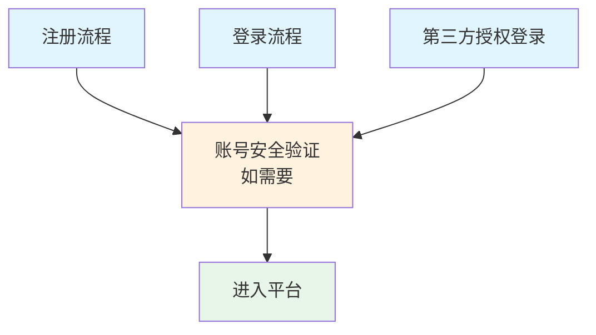

---

## 二、注册阶段业务流程

### 2.1 注册入口触发

#### 2.1.1 用户触发场景
| 触发场景 | 用户行为 | 业务说明 |
|---------|---------|---------|
| 首次打开APP | 点击"注册/登录"按钮 | 新用户无账号状态 |
| 浏览商品时 | 点击"立即购买"或"加入购物车" | 需要登录后才能进行购物操作 |
| 查看直播时 | 点击"关注主播"或"发送弹幕" | 需要登录后才能进行互动 |
| 个人中心 | 点击"我的"页面 | 引导未登录用户完成注册 |

#### 2.1.2 系统响应
- 展示注册方式选择页面
- 提供多种注册方式供用户选择
- 记录用户进入注册流程的行为数据

### 2.2 注册方式选择

#### 2.2.1 可选注册方式
```
┌─────────────────────────────────────────┐
│           选择注册方式                   │
├─────────────────────────────────────────┤
│                                         │
│   ┌─────────────────────────────────┐  │
│   │  📱 手机号注册（推荐）          │  │
│   │     快速便捷，支持一键登录      │  │
│   └─────────────────────────────────┘  │
│                                         │
│   ┌─────────────────────────────────┐  │
│   │  📧 邮箱注册                    │  │
│   │     适用于海外用户              │  │
│   └─────────────────────────────────┘  │
│                                         │
│   ┌─────────────────────────────────┐  │
│   │  🔗 第三方账号注册              │  │
│   │     微信/QQ/微博/支付宝等       │  │
│   └─────────────────────────────────┘  │
│                                         │
└─────────────────────────────────────────┘
```

#### 2.2.2 用户行为
1. 浏览可选注册方式
2. 选择一种注册方式
3. 进入对应注册流程

### 2.3 手机号注册流程

#### 2.3.1 流程步骤详解

**步骤1：输入手机号**
- **用户行为**：在手机号输入框中填写手机号码
- **系统校验**：
  - 校验手机号格式（11位数字）
  - 校验手机号是否已被注册
  - 校验手机号所属运营商
- **交互反馈**：
  - 格式错误：提示"请输入正确的手机号"
  - 已注册：提示"该手机号已注册，请直接登录"
  - 格式正确：启用"获取验证码"按钮

**步骤2：获取验证码**
- **用户行为**：点击"获取验证码"按钮
- **系统处理**：
  - 触发短信验证码发送服务
  - 生成6位数字验证码
  - 调用运营商短信通道发送短信
  - 启动60秒倒计时限制
- **交互反馈**：
  - 发送成功：提示"验证码已发送"
  - 发送失败：提示具体失败原因
  - 倒计时显示：显示"60秒后重新获取"

**步骤3：输入验证码**
- **用户行为**：在验证码输入框填写收到的6位数字
- **系统校验**：
  - 校验验证码格式（6位数字）
  - 校验验证码有效性（是否正确、是否过期）
- **交互反馈**：
  - 验证码错误：提示"验证码错误，请重新输入"
  - 验证码过期：提示"验证码已过期，请重新获取"

**步骤4：设置密码**
- **用户行为**：设置登录密码
- **系统要求**：
  - 密码长度：8-20位
  - 必须包含：字母+数字
  - 可选包含：特殊字符
- **密码强度提示**：
  - 弱：纯数字或纯字母
  - 中：字母+数字
  - 强：字母+数字+特殊字符

**步骤5：完善基础信息（可选）**
- **用户行为**：填写昵称、选择头像等
- **系统处理**：
  - 提供默认昵称（如"抖音用户+随机数字"）
  - 提供默认头像
  - 支持跳过此步骤

**步骤6：完成注册**
- **用户行为**：点击"完成注册"按钮
- **系统处理**：
  - 创建用户账号
  - 初始化用户数据
  - 自动登录并跳转至首页

#### 2.3.2 手机号注册流程图

```
┌─────────────────────────────────────────────────────────────────┐
│                      手机号注册流程                              │
└─────────────────────────────────────────────────────────────────┘

    用户行为                    系统处理                    数据流转
       │                           │                           │
       ▼                           ▼                           ▼
┌──────────────┐          ┌──────────────┐          ┌──────────────┐
│  输入手机号  │─────────▶│  格式校验    │─────────▶│  查询用户库  │
└──────────────┘          └──────────────┘          └──────────────┘
       │                           │                           │
       │                           ▼                           │
       │                    ┌──────────────┐                   │
       │                    │  校验结果    │                   │
       │                    └──────────────┘                   │
       │                           │                           │
       ▼                           ▼                           ▼
┌──────────────┐          ┌──────────────┐          ┌──────────────┐
│ 点击获取     │─────────▶│ 生成验证码   │─────────▶│ 调用短信服务 │
│ 验证码按钮   │          │ (6位数字)    │          │ 发送短信     │
└──────────────┘          └──────────────┘          └──────────────┘
       │                           │                           │
       ▼                           ▼                           ▼
┌──────────────┐          ┌──────────────┐          ┌──────────────┐
│  输入验证码  │─────────▶│  验证验证码  │─────────▶│  查询验证码  │
└──────────────┘          └──────────────┘          │  缓存记录    │
       │                           │                └──────────────┘
       │                           ▼                           │
       │                    ┌──────────────┐                   │
       │                    │  验证结果    │                   │
       │                    └──────────────┘                   │
       │                           │                           │
       ▼                           ▼                           ▼
┌──────────────┐          ┌──────────────┐          ┌──────────────┐
│  设置密码    │─────────▶│  密码强度    │─────────▶│  密码加密    │
│  (8-20位)    │          │  校验        │          │  存储        │
└──────────────┘          └──────────────┘          └──────────────┘
       │                           │                           │
       ▼                           ▼                           ▼
┌──────────────┐          ┌──────────────┐          ┌──────────────┐
│ 完善基础信息 │─────────▶│  数据验证    │─────────▶│  写入用户表  │
│ (昵称/头像)  │          │              │          │  初始化数据  │
└──────────────┘          └──────────────┘          └──────────────┘
       │                           │                           │
       ▼                           ▼                           ▼
┌──────────────┐          ┌──────────────┐          ┌──────────────┐
│ 点击完成     │─────────▶│  创建账号    │─────────▶│  生成Token   │
│ 注册按钮     │          │  自动登录    │          │  跳转首页    │
└──────────────┘          └──────────────┘          └──────────────┘
```

**Mermaid代码实现：**

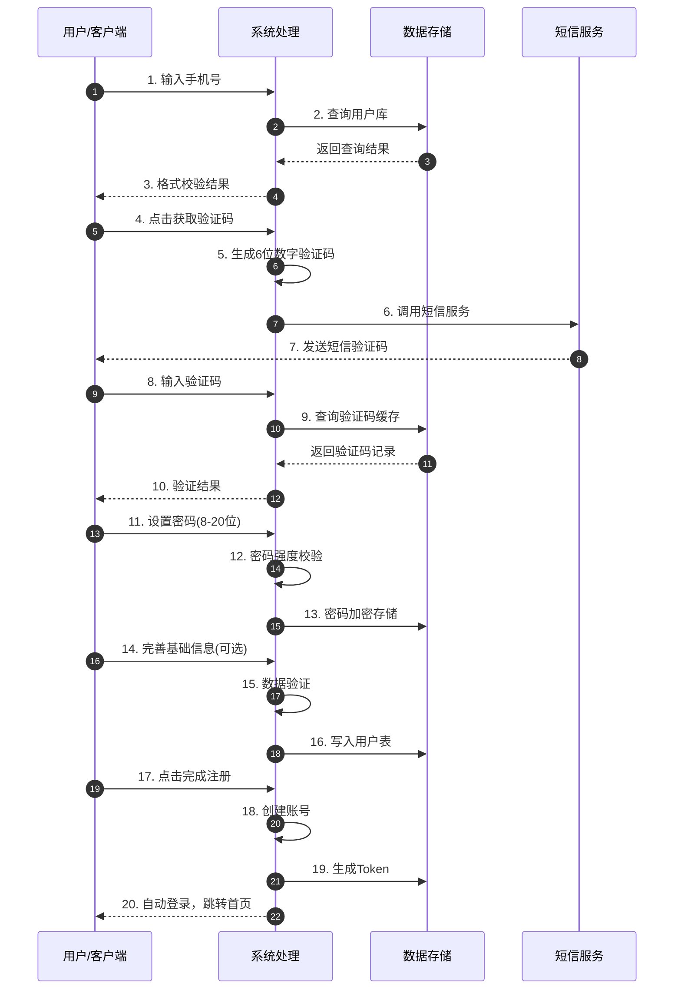

### 2.4 邮箱注册流程

#### 2.4.1 流程步骤详解

**步骤1：输入邮箱地址**
- **用户行为**：填写有效的邮箱地址
- **系统校验**：
  - 校验邮箱格式（包含@符号和域名）
  - 校验邮箱是否已被注册

**步骤2：获取邮箱验证码**
- **用户行为**：点击"获取验证码"按钮
- **系统处理**：
  - 生成6位数字验证码
  - 调用邮件服务发送验证邮件
  - 启动60秒倒计时

**步骤3：验证邮箱验证码**
- **用户行为**：输入邮箱中收到的验证码
- **系统校验**：验证验证码正确性和时效性

**步骤4：设置密码**
- **用户行为**：设置登录密码（同手机号注册）

**步骤5：完成注册**
- **系统处理**：创建账号并自动登录

### 2.5 第三方账号注册流程

#### 2.5.1 支持的第三方平台
- 微信
- QQ
- 微博
- 支付宝
- Apple ID（iOS端）

#### 2.5.2 流程步骤详解

**步骤1：选择第三方平台**
- **用户行为**：点击第三方平台图标
- **系统处理**：
  - 唤起第三方应用或H5授权页面
  - 传递应用ID和授权参数

**步骤2：第三方授权**
- **用户行为**：
  - 在第三方应用中确认授权
  - 同意授权抖音获取基本信息
- **系统处理**：
  - 接收第三方授权码
  - 调用第三方接口获取用户信息
  - 获取信息：OpenID、昵称、头像

**步骤3：绑定手机号（强制）**
- **业务说明**：根据监管要求，必须绑定手机号
- **用户行为**：
  - 输入手机号
  - 获取并输入短信验证码
- **系统处理**：
  - 校验手机号
  - 发送短信验证码
  - 验证手机号归属

**步骤4：完成注册**
- **系统处理**：
  - 创建账号并关联第三方OpenID
  - 导入第三方昵称和头像
  - 自动登录

#### 2.5.3 第三方注册流程图

```
┌─────────────────────────────────────────────────────────────────┐
│                    第三方账号注册流程                            │
└─────────────────────────────────────────────────────────────────┘

    用户行为                    系统处理                    外部服务
       │                           │                           │
       ▼                           ▼                           ▼
┌──────────────┐          ┌──────────────┐          ┌──────────────┐
│ 选择第三方   │─────────▶│ 唤起授权     │─────────▶│ 第三方平台   │
│ 平台图标     │          │ 页面/APP     │          │ (微信/QQ等)  │
└──────────────┘          └──────────────┘          └──────────────┘
       │                           │                           │
       ▼                           ▼                           ▼
┌──────────────┐          ┌──────────────┐          ┌──────────────┐
│ 确认授权     │─────────▶│ 接收授权码   │─────────▶│ 获取用户信息 │
│ (第三方端)   │          │              │          │ (OpenID等)   │
└──────────────┘          └──────────────┘          └──────────────┘
       │                           │                           │
       │                           ▼                           │
       │                    ┌──────────────┐                   │
       │                    │ 查询是否已   │                   │
       │                    │ 绑定手机号   │                   │
       │                    └──────────────┘                   │
       │                           │                           │
       ▼                           ▼                           ▼
┌──────────────┐          ┌──────────────┐          ┌──────────────┐
│ 输入手机号   │─────────▶│ 手机号校验   │─────────▶│ 短信服务     │
│ 获取验证码   │          │ 发送验证码   │          │ 发送短信     │
└──────────────┘          └──────────────┘          └──────────────┘
       │                           │                           │
       ▼                           ▼                           ▼
┌──────────────┐          ┌──────────────┐          ┌──────────────┐
│ 输入验证码   │─────────▶│ 验证手机号   │─────────▶│ 创建用户账号 │
└──────────────┘          └──────────────┘          │ 关联第三方   │
       │                           │                └──────────────┘
       │                           ▼                           │
       │                    ┌──────────────┐                   │
       │                    │  自动登录    │                   │
       │                    │  跳转首页    │                   │
       │                    └──────────────┘                   │
       │                                                       │
       ▼                                                       ▼
                    ┌──────────────────────────────────────────┐
                    │              注册完成，进入平台           │
                    └──────────────────────────────────────────┘
```

**Mermaid代码实现：**

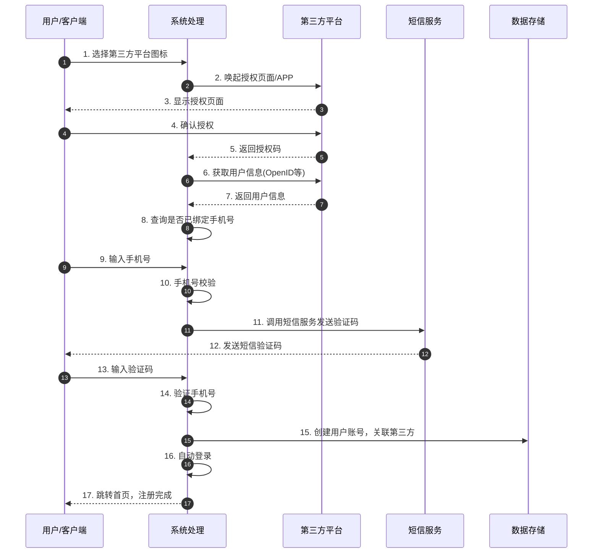

---

### 2.6 注册阶段风控策略

#### 一、风险行为识别

| 风险类型 | 风险行为描述 | 风险等级 |
|---------|-------------|---------|
| **批量注册** | 同一设备/IP短时间内大量注册账号 | 高 |
| **虚假注册** | 使用虚拟手机号、接码平台手机号注册 | 高 |
| **机器注册** | 使用自动化脚本、模拟器进行注册 | 高 |
| **身份冒用** | 盗用他人身份信息注册账号 | 极高 |
| **黑产养号** | 注册后长期静默，后续用于违规操作 | 中 |
| **恶意拉新** | 利用注册奖励机制进行欺诈性注册 | 中 |
| **设备伪造** | 使用改机工具、模拟器伪装真实设备 | 高 |
| **网络代理** | 使用VPN、代理IP绕过地域限制 | 中 |

#### 二、风控介入节点与策略

```
┌─────────────────────────────────────────────────────────────────┐
│                    注册流程风控介入点                            │
├─────────────────────────────────────────────────────────────────┤
│                                                                 │
│  输入手机号 ──▶ 获取验证码 ──▶ 输入验证码 ──▶ 设置密码 ──▶ [提交注册] │
│       │              │              │             │          ▲   │
│       ▼              ▼              ▼             ▼          │   │
│   ┌──────┐      ┌──────┐      ┌──────┐     ┌──────┐    ┌──────┐ │
│   │设备  │      │频率  │      │行为  │     │密码  │    │综合  │ │
│   │风控  │      │风控  │      │验证  │     │强度  │    │风控  │ │
│   └──────┘      └──────┘      └──────┘     └──────┘    └──────┘ │
│       │              │              │             │          │   │
│       ▼              ▼              ▼             ▼          ▼   │
│   拦截/验证      限制/阻断      挑战验证      提示优化    决策引擎 │
│                                                                 │
└─────────────────────────────────────────────────────────────────┘
```

**Mermaid代码实现：**

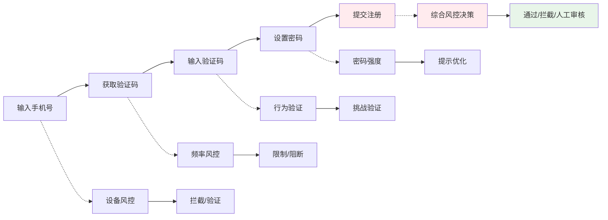

#### 三、风险识别能力部署

**1. 设备维度识别**

| 识别能力 | 技术实现 | 识别目标 |
|---------|---------|---------|
| 设备指纹 | 采集设备硬件信息、系统参数、浏览器特征 | 识别虚拟机、模拟器、改机工具 |
| 设备关联 | 分析设备与账号、手机号的关联关系 | 发现批量注册设备 |
| 设备信誉 | 建立设备历史行为评分体系 | 识别高风险设备 |
| 设备环境 | 检测Root/越狱、调试模式、代理设置 | 识别异常操作环境 |

**2. 手机号维度识别**

| 识别能力 | 技术实现 | 识别目标 |
|---------|---------|---------|
| 手机号归属 | 对接运营商数据、虚拟号段库 | 识别虚拟号、物联网卡 |
| 接码平台检测 | 维护接码平台号码库、行为特征分析 | 识别接码平台手机号 |
| 手机号关联 | 分析手机号与设备、IP的关联 | 发现一号多设备、一设备多号 |
| 短信拦截检测 | 分析验证码接收和输入时间间隔 | 识别短信拦截软件 |

**3. 行为维度识别**

| 识别能力 | 技术实现 | 识别目标 |
|---------|---------|---------|
| 操作轨迹分析 | 采集鼠标移动、点击位置、输入节奏 | 识别机器自动化操作 |
| 时间模式分析 | 分析注册时间分布、操作间隔 | 识别批量注册行为 |
| 生物行为特征 | 分析打字速度、滑动轨迹、按压力度 | 区分人机操作 |
| 页面停留分析 | 监测页面停留时长、跳转路径 | 识别异常浏览行为 |

**4. 网络维度识别**

| 识别能力 | 技术实现 | 识别目标 |
|---------|---------|---------|
| IP风险识别 | IP归属地、IP类型、IP信誉库 | 识别代理IP、数据中心IP |
| IP关联分析 | 分析IP与账号、设备的关联 | 发现同一IP批量注册 |
| 地理位置校验 | GPS定位、基站定位、IP定位交叉验证 | 识别位置伪造 |
| 网络环境检测 | 检测VPN、代理、Tor网络 | 识别网络伪装 |

#### 四、风险分级处置策略

| 风险等级 | 风险评分 | 处置策略 | 用户反馈 |
|---------|---------|---------|---------|
| **极低风险** | 0-20 | 直接通过，正常注册 | 无感知，流程顺畅 |
| **低风险** | 21-40 | 标准流程，记录日志 | 正常完成注册 |
| **中风险** | 41-60 | 增强验证（图形验证码） | 提示"请完成安全验证" |
| **高风险** | 61-80 | 严格验证（短信+图形验证码） | 提示"安全验证升级" |
| **极高风险** | 81-100 | 拦截注册，记录证据 | 提示"注册失败，请稍后再试" |

**分级处置流程图：**

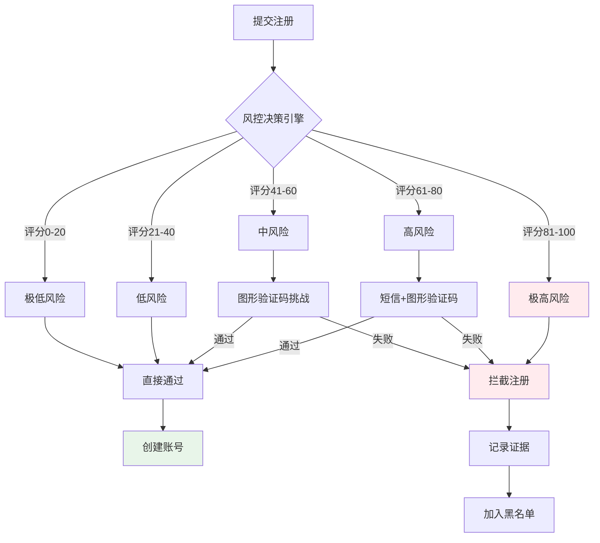

#### 五、误判处理机制

**1. 申诉渠道设计**

| 申诉场景 | 申诉入口 | 处理方式 | 处理时效 |
|---------|---------|---------|---------|
| 注册被拦截 | 客服热线、在线申诉表单 | 人工审核 | 24小时内 |
| 验证无法通过 | 页面"帮助"入口、换方式验证 | 提供替代验证 | 实时 |
| 设备被误封 | 账号申诉中心 | 设备解封审核 | 1-3工作日 |
| 手机号被限制 | 运营商认证、人工审核 | 解除限制 | 24小时内 |

**2. 审核机制**

```
申诉受理流程：
┌─────────┐    ┌─────────┐    ┌─────────┐    ┌─────────┐
│ 提交申诉 │───▶│ 初审    │───▶│ 复核    │───▶│ 结果通知 │
│         │    │ 自动+人工│    │ 风控专家│    │         │
└─────────┘    └─────────┘    └─────────┘    └─────────┘
                  │              │
                  ▼              ▼
            ┌─────────┐    ┌─────────┐
            │ 证据调取 │    │ 人工研判 │
            │ 日志查询 │    │ 视频审核 │
            └─────────┘    └─────────┘
```

**3. 用户权益恢复**

| 误判类型 | 恢复措施 | 补偿方案 |
|---------|---------|---------|
| 正常用户被拦截 | 解除限制，优先通过 | 赠送优惠券/积分 |
| 验证流程异常 | 简化验证，快速通道 | 无 |
| 设备误封 | 设备解封，白名单保护 | 账号安全险 |
| 手机号误限 | 解除限制，信誉修复 | 无 |

**4. 误判预防优化**

- **A/B测试**：对风控策略进行小流量测试，评估误判率
- **用户反馈收集**：建立用户反馈通道，及时发现误判案例
- **模型迭代**：基于误判案例优化风控模型，降低误杀率
- **白名单机制**：对高信誉用户、VIP用户提供风控豁免

---

## 三、登录阶段业务流程

### 3.1 登录入口触发

#### 3.1.1 用户触发场景
| 触发场景 | 用户行为 | 业务说明 |
|---------|---------|---------|
| 主动登录 | 点击"我的"页面登录按钮 | 用户主动发起登录 |
| 功能触发 | 点击需要登录的功能 | 如购买、评论、关注等 |
| 会话过期 | 打开APP时Token失效 | 需要重新登录 |
| 切换账号 | 点击"切换账号" | 退出当前账号登录新账号 |

### 3.2 登录方式选择

#### 3.2.1 可选登录方式
```
┌─────────────────────────────────────────┐
│           选择登录方式                   │
├─────────────────────────────────────────┤
│                                         │
│   ┌─────────────────────────────────┐  │
│   │  📱 手机号+密码登录             │  │
│   │     传统登录方式                │  │
│   └─────────────────────────────────┘  │
│                                         │
│   ┌─────────────────────────────────┐  │
│   │  📱 手机号+验证码登录           │  │
│   │     免密快捷登录                │  │
│   └─────────────────────────────────┘  │
│                                         │
│   ┌─────────────────────────────────┐  │
│   │  📧 邮箱+密码登录               │  │
│   │     适用于邮箱注册用户          │  │
│   └─────────────────────────────────┘  │
│                                         │
│   ┌─────────────────────────────────┐  │
│   │  🔗 第三方账号登录              │  │
│   │     一键授权登录                │  │
│   └─────────────────────────────────┘  │
│                                         │
│   ┌─────────────────────────────────┐  │
│   │  🔐 本机号码一键登录            │  │
│   │     运营商认证，无需输入        │  │
│   └─────────────────────────────────┘  │
│                                         │
└─────────────────────────────────────────┘
```

### 3.3 手机号+密码登录流程

#### 3.3.1 流程步骤详解

**步骤1：输入手机号**
- **用户行为**：填写注册时使用的手机号
- **系统校验**：校验手机号格式

**步骤2：输入密码**
- **用户行为**：输入登录密码
- **系统处理**：
  - 密码输入框默认隐藏（支持显示/隐藏切换）
  - 记录密码错误次数

**步骤3：点击登录**
- **用户行为**：点击"登录"按钮
- **系统处理**：
  - 校验账号是否存在
  - 校验密码是否正确
  - 校验账号状态（是否冻结、注销等）

**步骤4：登录结果处理**
| 结果类型 | 系统处理 | 用户反馈 |
|---------|---------|---------|
| 登录成功 | 生成Token，跳转首页 | 进入平台首页 |
| 密码错误 | 记录错误次数 | 提示"密码错误，还剩X次机会" |
| 账号冻结 | 拒绝登录 | 提示"账号已被冻结，请联系客服" |
| 账号不存在 | 提示注册 | 提示"账号不存在，请先注册" |

#### 3.3.2 密码错误处理机制
- 连续错误3次：增加图形验证码
- 连续错误5次：账号锁定30分钟
- 连续错误10次：账号冻结，需人工审核

### 3.4 手机号+验证码登录流程

#### 3.4.1 流程步骤详解

**步骤1：输入手机号**
- **用户行为**：填写手机号
- **系统校验**：
  - 校验手机号格式
  - 校验手机号是否已注册

**步骤2：获取验证码**
- **用户行为**：点击"获取验证码"
- **系统处理**：
  - 生成6位数字验证码
  - 调用短信服务发送
  - 启动60秒倒计时

**步骤3：输入验证码并登录**
- **用户行为**：输入验证码，点击"登录"
- **系统处理**：
  - 验证验证码正确性
  - 验证验证码时效性
  - 生成登录Token

### 3.5 本机号码一键登录流程

#### 3.5.1 业务说明
利用运营商网关认证能力，自动获取当前手机SIM卡号码，无需用户手动输入手机号和验证码。

#### 3.5.2 流程步骤详解

**步骤1：点击一键登录按钮**
- **用户行为**：点击"本机号码一键登录"
- **系统处理**：
  - 调用运营商SDK
  - 请求网关认证

**步骤2：运营商认证**
- **系统处理**：
  - 向运营商网关发送认证请求
  - 运营商返回加密后的手机号
  - 系统解密获取手机号

**步骤3：自动登录**
- **系统处理**：
  - 查询手机号对应的账号
  - 自动生成登录Token
  - 跳转首页

#### 3.5.3 一键登录流程图

```
┌─────────────────────────────────────────────────────────────────┐
│                    本机号码一键登录流程                          │
└─────────────────────────────────────────────────────────────────┘

    用户行为                    系统处理                    运营商
       │                           │                           │
       ▼                           ▼                           ▼
┌──────────────┐          ┌──────────────┐          ┌──────────────┐
│ 点击一键     │─────────▶│ 调用运营商   │─────────▶│ 网关认证     │
│ 登录按钮     │          │ SDK          │          │ 请求         │
└──────────────┘          └──────────────┘          └──────────────┘
       │                           │                           │
       │                           │                           ▼
       │                           │◀─────────────────────────┐
       │                           │    返回加密手机号        │
       │                           │                          │
       │                           ▼                          │
       │                    ┌──────────────┐                  │
       │                    │ 解密手机号   │                  │
       │                    │ 查询用户账号 │                  │
       │                    └──────────────┘                  │
       │                           │                          │
       │                           ▼                          │
       │                    ┌──────────────┐                  │
       │                    │ 生成Token    │                  │
       │                    │ 更新登录状态 │                  │
       │                    └──────────────┘                  │
       │                           │                          │
       ▼                           ▼                          ▼
┌─────────────────────────────────────────────────────────────────┐
│                         登录成功，进入平台                       │
└─────────────────────────────────────────────────────────────────┘
```

**Mermaid代码实现：**

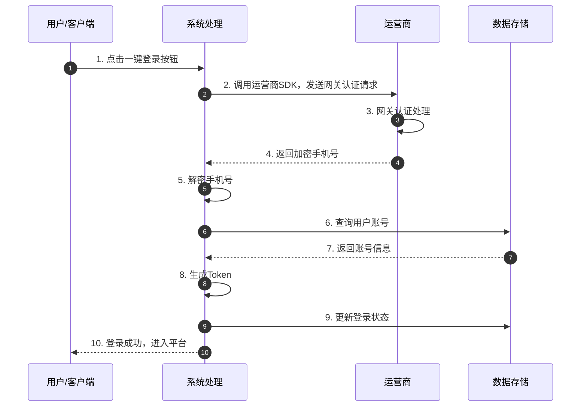

### 3.6 第三方账号登录流程

#### 3.6.1 流程步骤详解

**步骤1：选择第三方平台**
- **用户行为**：点击第三方平台图标
- **系统处理**：唤起第三方授权页面

**步骤2：第三方授权**
- **用户行为**：在第三方平台确认授权
- **系统处理**：
  - 获取第三方OpenID
  - 查询是否已绑定抖音账号

**步骤3：登录处理**
| 场景 | 系统处理 |
|-----|---------|
| 已绑定账号 | 直接登录，跳转首页 |
| 未绑定账号 | 引导绑定手机号或注册新账号 |

### 3.7 登录阶段风控策略

#### 一、风险行为识别

| 风险类型 | 风险行为描述 | 风险等级 |
|---------|-------------|---------|
| **暴力破解** | 使用自动化工具批量尝试密码 | 极高 |
| **撞库攻击** | 使用泄露的账号密码组合尝试登录 | 极高 |
| **账号盗用** | 盗取他人账号密码进行登录 | 极高 |
| **异常设备登录** | 在新设备、新地点、异常时间登录 | 中 |
| **批量登录** | 同一设备/IP批量尝试登录多个账号 | 高 |
| **验证码爆破** | 批量尝试验证码组合 | 高 |
| **会话劫持** | 盗取Token、Cookie进行登录 | 极高 |
| **代理登录** | 使用代理IP、VPN隐藏真实位置 | 中 |

#### 二、风控介入节点与策略

```
┌─────────────────────────────────────────────────────────────────┐
│                    登录流程风控介入点                            │
├─────────────────────────────────────────────────────────────────┤
│                                                                 │
│  输入账号 ──▶ 输入密码 ──▶ 点击登录 ──▶ [登录验证] ──▶ 登录成功   │
│      │           │            │            ▲                │   │
│      ▼           ▼            ▼            │                │   │
│  ┌──────┐   ┌──────┐    ┌──────┐     ┌──────┐          ┌──────┐ │
│  │账号  │   │密码  │    │行为  │     │综合  │          │设备  │ │
│  │风控  │   │风控  │    │验证  │     │决策  │          │验证  │ │
│  └──────┘   └──────┘    └──────┘     └──────┘          └──────┘ │
│      │           │            │            │                │   │
│      ▼           ▼            ▼            ▼                ▼   │
│  黑名单拦截  错误计数   人机验证挑战   通过/拦截/验证    新设备验证 │
│                                                                 │
└─────────────────────────────────────────────────────────────────┘
```

**Mermaid代码实现：**

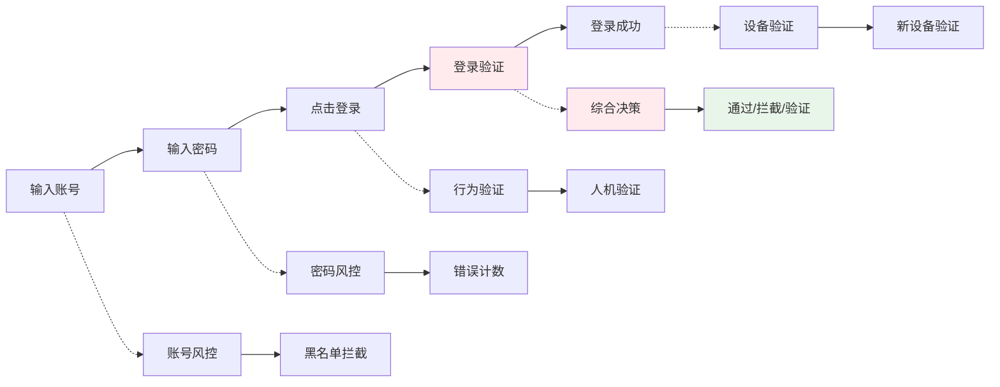

#### 三、风险识别能力部署

**1. 账号维度识别**

| 识别能力 | 技术实现 | 识别目标 |
|---------|---------|---------|
| 账号信誉评分 | 基于历史行为、注册信息、关联设备评分 | 识别高风险账号 |
| 账号状态监控 | 实时监控账号异常行为标记 | 识别被盗号、违规账号 |
| 账号关联分析 | 分析账号与设备、IP、手机号的关联 | 发现账号共享、买卖 |
| 登录模式学习 | 建立用户正常登录行为基线 | 识别异常登录行为 |

**2. 密码安全识别**

| 识别能力 | 技术实现 | 识别目标 |
|---------|---------|---------|
| 密码错误监控 | 记录密码错误次数、时间分布 | 识别暴力破解攻击 |
| 弱密码检测 | 检测常见弱密码、泄露密码 | 提示用户修改密码 |
| 密码泄露检测 | 对接泄露密码库、暗网数据 | 识别使用泄露密码的账号 |
| 撞库攻击识别 | 监控异常登录成功/失败模式 | 识别撞库攻击行为 |

**3. 设备与环境识别**

| 识别能力 | 技术实现 | 识别目标 |
|---------|---------|---------|
| 设备指纹识别 | 采集设备硬件、软件特征 | 识别异常设备 |
| 设备信任体系 | 建立设备-账号信任关系 | 识别新设备、陌生设备 |
| 地理位置分析 | GPS、IP、基站多源定位 | 识别异常登录地点 |
| 登录时间分析 | 分析用户正常登录时间规律 | 识别异常时间登录 |

**4. 行为与网络识别**

| 识别能力 | 技术实现 | 识别目标 |
|---------|---------|---------|
| 操作行为分析 | 采集鼠标轨迹、输入节奏 | 识别机器自动化登录 |
| 登录频率控制 | 限制单位时间登录尝试次数 | 防止暴力破解 |
| IP风险识别 | IP信誉库、代理检测 | 识别高风险IP |
| 网络环境检测 | 检测VPN、代理、Tor | 识别网络伪装 |

#### 四、风险分级处置策略

| 风险等级 | 触发条件 | 处置策略 | 用户反馈 |
|---------|---------|---------|---------|
| **极低风险** | 常用设备、常用地点、正常时间 | 直接登录，无感验证 | 正常进入首页 |
| **低风险** | 可信设备、轻微异常 | 标准登录流程 | 正常登录 |
| **中风险** | 新设备、新地点、长期未登录 | 二次验证（短信/邮箱） | "请验证身份" |
| **高风险** | 异常设备、异地登录、密码错误 | 强制安全验证（多因素） | "账号安全验证" |
| **极高风险** | 暴力破解、撞库攻击、账号被盗 | 拦截登录，锁定账号 | "账号异常，请联系客服" |

**分级处置流程图：**

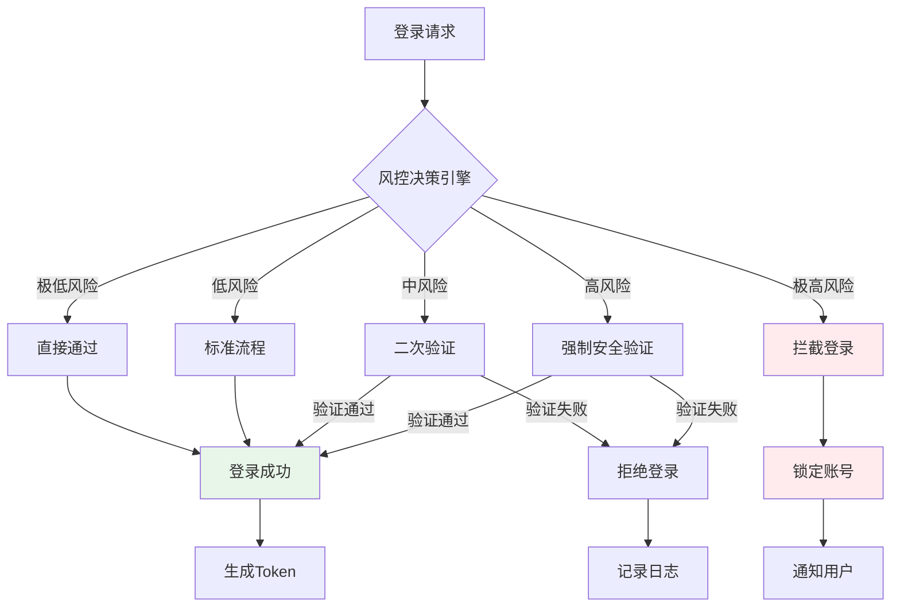

#### 五、误判处理机制

**1. 申诉渠道设计**

| 申诉场景 | 申诉入口 | 处理方式 | 处理时效 |
|---------|---------|---------|---------|
| 登录被拦截 | 登录页"无法登录"、客服热线 | 身份验证+人工审核 | 2小时内 |
| 账号被锁定 | 账号申诉中心、APP内申诉 | 多因素验证+人工复核 | 4小时内 |
| 设备被限制 | 安全中心、设备管理 | 设备解绑+重新验证 | 实时 |
| 异地登录拦截 | 短信验证、邮箱验证 | 自助验证解除 | 实时 |

**2. 紧急恢复机制**

```
紧急登录恢复流程：
┌─────────┐    ┌─────────┐    ┌─────────┐    ┌─────────┐
│ 点击紧急 │───▶│ 身份验证 │───▶│ 人工审核 │───▶│ 临时解除 │
│ 登录入口 │    │ 多因素   │    │ 快速通道 │    │ 限制     │
└─────────┘    └─────────┘    └─────────┘    └─────────┘
                                              │
                                              ▼
                                        ┌─────────┐
                                        │ 24小时内│
                                        │ 完成复核│
                                        └─────────┘
```

**3. 用户权益保障**

| 误判类型 | 恢复措施 | 补偿方案 |
|---------|---------|---------|
| 正常登录被拦截 | 解除限制，添加信任设备 | 赠送积分/优惠券 |
| 账号被误锁 | 立即解锁，延长登录态 | 账号安全险赔付 |
| 验证流程异常 | 简化验证，优先通道 | 无 |
| 设备被误限 | 设备解限，白名单保护 | 无 |

**4. 安全与体验平衡策略**

- **渐进式验证**：根据风险等级逐步升级验证强度
- **智能免密**：可信设备、常用场景支持免密登录
- **一键求助**：提供快速人工客服通道
- **安全提示**：清晰告知用户限制原因，提供解决指引

---

## 四、账号安全验证流程

### 4.1 触发安全验证的场景

#### 4.1.1 登录时触发
- 在新设备上首次登录
- 在非常用地点登录
- 长期未登录后再次登录
- 密码连续输入错误
- 账号存在异常行为记录

#### 4.1.2 操作时触发
- 修改绑定手机号
- 修改登录密码
- 修改支付密码
- 提现操作
- 大额交易

### 4.2 安全验证方式

#### 4.2.1 可选验证方式
```
┌─────────────────────────────────────────┐
│           安全验证方式                   │
├─────────────────────────────────────────┤
│                                         │
│   ┌─────────────────────────────────┐  │
│   │  📱 短信验证码验证              │  │
│   │     发送至绑定手机号            │  │
│   └─────────────────────────────────┘  │
│                                         │
│   ┌─────────────────────────────────┐  │
│   │  🧩 图形验证码验证              │  │
│   │     防止机器自动化操作          │  │
│   └─────────────────────────────────┘  │
│                                         │
│   ┌─────────────────────────────────┐  │
│   │  🧬 人脸识别验证                │  │
│   │     高安全等级验证              │  │
│   └─────────────────────────────────┘  │
│                                         │
│   ┌─────────────────────────────────┐  │
│   │  🔐 支付密码验证                │  │
│   │     敏感操作验证                │  │
│   └─────────────────────────────────┘  │
│                                         │
└─────────────────────────────────────────┘
```

### 4.3 新设备登录验证流程

#### 4.3.1 流程步骤详解

**步骤1：检测新设备**
- **系统检测**：对比当前设备ID与历史登录设备
- **判定规则**：
  - 设备ID不在历史设备列表中
  - 设备指纹特征不匹配

**步骤2：发起安全验证**
- **系统处理**：
  - 向绑定手机号发送短信验证码
  - 或要求输入支付密码
  - 或进行人脸识别

**步骤3：用户完成验证**
- **用户行为**：
  - 输入收到的短信验证码
  - 或输入支付密码
  - 或完成人脸识别

**步骤4：验证结果处理**
| 结果 | 系统处理 |
|-----|---------|
| 验证通过 | 登录成功，将设备加入信任设备列表 |
| 验证失败 | 提示失败原因，允许重试或更换验证方式 |

### 4.4 账号安全验证风控策略

#### 一、风险行为识别

| 风险类型 | 风险行为描述 | 风险等级 |
|---------|-------------|---------|
| **验证绕过** | 尝试绕过安全验证机制直接访问 | 极高 |
| **验证码窃取** | 通过木马、钓鱼等方式获取验证码 | 极高 |
| **验证欺诈** | 使用AI换脸、深度伪造技术通过人脸验证 | 极高 |
| **验证劫持** | 拦截、篡改验证过程中的通信数据 | 极高 |
| **暴力破解** | 批量尝试验证码组合 | 高 |
| **社工攻击** | 通过欺骗手段获取用户验证信息 | 高 |
| **设备伪装** | 伪造设备信息通过新设备验证 | 高 |
| **SIM卡交换** | 通过运营商漏洞劫持手机号 | 极高 |

#### 二、风控介入节点与策略

```
┌─────────────────────────────────────────────────────────────────┐
│                  安全验证流程风控介入点                          │
├─────────────────────────────────────────────────────────────────┤
│                                                                 │
│  触发验证 ──▶ 选择验证方式 ──▶ 发起验证 ──▶ 完成验证 ──▶ [验证结果] │
│      │             │             │            │          ▲     │
│      ▼             ▼             ▼            ▼          │     │
│  ┌──────┐    ┌──────┐     ┌──────┐     ┌──────┐    ┌──────┐   │
│  │触发  │    │方式  │     │过程  │     │行为  │    │综合  │   │
│  │风控  │    │风控  │     │监控  │     │分析  │    │决策  │   │
│  └──────┘    └──────┘     └──────┘     └──────┘    └──────┘   │
│      │             │             │            │          │     │
│      ▼             ▼             ▼            ▼          ▼     │
│  异常拦截    动态选择      实时监控      生物识别      通过/拦截 │
│                                                                 │
└─────────────────────────────────────────────────────────────────┘
```

**Mermaid代码实现：**

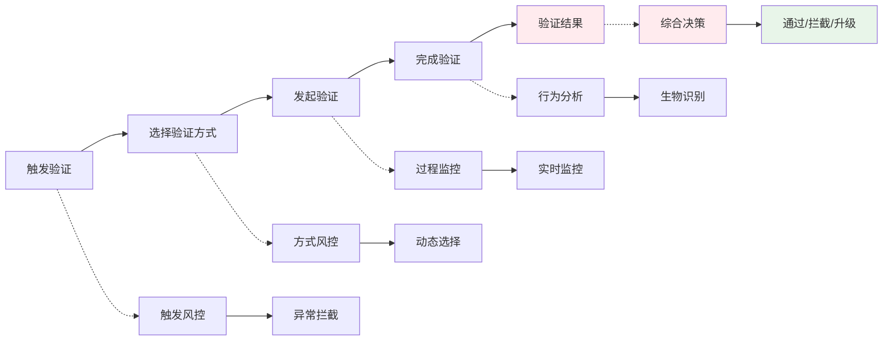

#### 三、风险识别能力部署

**1. 验证触发风控**

| 识别能力 | 技术实现 | 识别目标 |
|---------|---------|---------|
| 异常触发检测 | 分析验证触发频率、场景合理性 | 识别异常验证请求 |
| 触发模式分析 | 建立用户正常操作基线 | 识别非用户主动触发 |
| 会话完整性校验 | 验证会话链路的完整性 | 识别会话劫持 |
| 请求来源验证 | 校验请求来源的合法性 | 识别伪造请求 |

**2. 验证方式动态选择**

| 识别能力 | 技术实现 | 识别目标 |
|---------|---------|---------|
| 风险自适应 | 根据风险等级动态选择验证方式 | 平衡安全与体验 |
| 用户偏好学习 | 学习用户常用验证方式 | 提升验证通过率 |
| 验证方式轮换 | 避免单一验证方式被攻破 | 增强安全性 |
| 多因素组合 | 高风险场景强制多因素验证 | 提升验证强度 |

**3. 验证过程监控**

| 识别能力 | 技术实现 | 识别目标 |
|---------|---------|---------|
| 验证码安全传输 | 加密传输、防截屏、防录屏 | 防止验证码泄露 |
| 验证时效控制 | 严格限制验证码有效期 | 防止验证码复用 |
| 验证环境检测 | 检测验证时的设备、网络环境 | 识别环境异常 |
| 验证行为分析 | 分析验证操作的行为特征 | 识别机器操作 |

**4. 生物特征识别（人脸验证）**

| 识别能力 | 技术实现 | 识别目标 |
|---------|---------|---------|
| 活体检测 | 动作活体、静默活体、光线活体 | 防止照片、视频攻击 |
| 深度伪造检测 | AI模型识别深度伪造内容 | 防止AI换脸攻击 |
| 人脸比对 | 1:1人脸相似度计算 | 确认用户身份 |
| 攻击痕迹检测 | 检测屏幕翻拍、面具攻击痕迹 | 识别物理攻击 |

#### 四、风险分级处置策略

| 风险等级 | 触发条件 | 验证策略 | 失败处置 |
|---------|---------|---------|---------|
| **极低风险** | 可信设备、常用地点 | 短信验证码 | 允许重试3次 |
| **低风险** | 轻微异常 | 短信+图形验证码 | 允许重试3次，失败后锁定15分钟 |
| **中风险** | 新设备、异地 | 短信+人脸识别 | 允许重试2次，失败后锁定30分钟 |
| **高风险** | 异常设备、可疑行为 | 多因素验证（短信+人脸+支付密码） | 允许重试1次，失败后锁定2小时 |
| **极高风险** | 攻击特征明显 | 人工审核+多因素验证 | 立即锁定，人工介入 |

**分级验证流程图：**

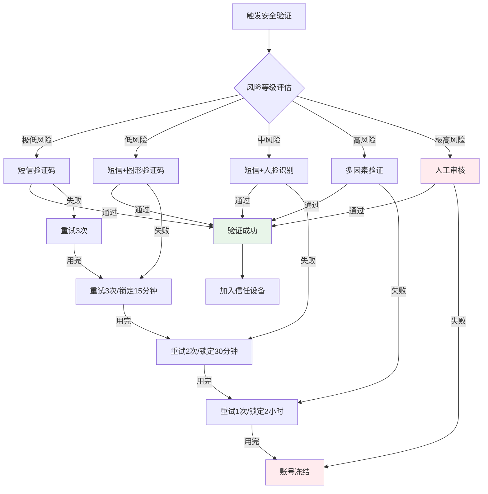

#### 五、误判处理机制

**1. 申诉渠道设计**

| 申诉场景 | 申诉入口 | 处理方式 | 处理时效 |
|---------|---------|---------|---------|
| 验证无法通过 | 验证页面"遇到问题"、客服热线 | 人工辅助验证 | 实时 |
| 人脸验证失败 | 换方式验证、人工视频审核 | 多方式验证 | 10分钟内 |
| 验证码收不到 | 重发验证码、换方式验证 | 自动+人工 | 实时 |
| 被误判为攻击 | 账号申诉中心、安全中心 | 人工复核 | 2小时内 |

**2. 辅助验证机制**

```
主验证失败后的辅助验证流程：
┌─────────┐    ┌─────────┐    ┌─────────┐    ┌─────────┐
│ 主验证  │───▶│ 换方式  │───▶│ 好友    │───▶│ 人工    │
│ 失败    │    │ 验证    │    │ 辅助    │    │ 审核    │
└─────────┘    └─────────┘    └─────────┘    └─────────┘
     │              │              │              │
     ▼              ▼              ▼              ▼
  短信/人脸    支付密码/邮箱    好友验证码    视频认证
  失败3次      验证失败        辅助验证      人工复核
```

**3. 用户权益保障**

| 误判类型 | 恢复措施 | 补偿方案 |
|---------|---------|---------|
| 人脸验证误判 | 人工审核通过，优化模型 | 赠送优惠券 |
| 验证方式受限 | 开放更多验证方式 | 无 |
| 账号被误锁 | 立即解锁，延长会话 | 账号安全险 |
| 验证流程异常 | 简化流程，优先通道 | 积分补偿 |

**4. 安全验证优化策略**

- **智能降级**：高风险用户通过后逐步降低验证强度
- **无感验证**：可信用户减少验证频次
- **快速通道**：VIP用户、高信誉用户优先验证
- **教育引导**：对验证失败用户提供操作指引和安全教育

---

## 五、涉及系统组件及服务

### 5.1 核心系统组件

#### 5.1.1 用户服务（User Service）
- **功能职责**：
  - 用户账号的创建、查询、更新
  - 用户基础信息管理
  - 用户状态管理（正常/冻结/注销）
- **涉及数据表**：
  - 用户基础信息表
  - 用户账号状态表
  - 用户设备绑定表

#### 5.1.2 认证服务（Auth Service）
- **功能职责**：
  - 登录认证
  - Token生成与校验
  - 会话管理
  - 密码加密与校验
- **涉及数据表**：
  - 用户认证信息表
  - Token记录表
  - 登录日志表

#### 5.1.3 验证码服务（Verification Service）
- **功能职责**：
  - 验证码生成
  - 验证码发送（短信/邮件）
  - 验证码校验
  - 发送频率控制
- **涉及数据表**：
  - 验证码记录表
  - 发送频率控制表

#### 5.1.4 第三方登录服务（OAuth Service）
- **功能职责**：
  - 第三方平台授权对接
  - OpenID管理
  - 第三方用户信息获取
- **涉及数据表**：
  - 第三方账号绑定表

### 5.2 外部服务

#### 5.2.1 短信服务
- **服务提供商**：运营商或第三方短信平台
- **功能**：发送短信验证码
- **调用场景**：
  - 注册时发送验证码
  - 登录时发送验证码
  - 安全验证时发送验证码

#### 5.2.2 邮件服务
- **服务提供商**：企业邮件服务或第三方邮件平台
- **功能**：发送邮箱验证码
- **调用场景**：
  - 邮箱注册验证
  - 邮箱绑定验证

#### 5.2.3 运营商认证服务
- **服务提供商**：中国移动/联通/电信运营商
- **功能**：本机号码一键登录
- **调用场景**：
  - 用户选择一键登录时

### 5.3 数据存储

#### 5.3.1 数据库
| 数据类型 | 存储位置 | 说明 |
|---------|---------|------|
| 用户基础信息 | 主数据库 | 用户ID、昵称、头像等 |
| 认证信息 | 主数据库 | 密码哈希、手机号、邮箱等 |
| 验证码 | 缓存（Redis） | 5-10分钟过期 |
| Token | 缓存（Redis） | 根据有效期设置 |
| 登录日志 | 日志数据库 | 长期存储 |

#### 5.3.2 缓存使用
- **验证码缓存**：临时存储，5-10分钟过期
- **Token缓存**：存储登录态，支持多端登录
- **频率限制缓存**：限制短信发送频率

### 5.4 系统架构图

```
┌─────────────────────────────────────────────────────────────────┐
│                        客户端层                                 │
│  ┌────────────┐  ┌────────────┐  ┌────────────┐  ┌───────────┐ │
│  │   APP端    │  │   H5端     │  │  小程序端  │  │  PC端     │ │
│  │ (iOS/安卓) │  │ (浏览器)   │  │ (微信等)   │  │ (Web)     │ │
│  └─────┬──────┘  └─────┬──────┘  └─────┬──────┘  └─────┬─────┘ │
└────────┼───────────────┼───────────────┼───────────────┼───────┘
         │               │               │               │
         └───────────────┴───────┬───────┴───────────────┘
                                 │
┌────────────────────────────────▼────────────────────────────────┐
│                      API网关层                                  │
│              路由、限流、鉴权、日志                              │
└────────────────────────────────┬────────────────────────────────┘
                                 │
         ┌───────────────────────┼───────────────────────┐
         │                       │                       │
         ▼                       ▼                       ▼
┌─────────────────┐    ┌─────────────────┐    ┌─────────────────┐
│   用户服务      │    │   认证服务      │    │  验证码服务     │
│  User Service   │    │  Auth Service   │    │ Verify Service  │
└────────┬────────┘    └────────┬────────┘    └────────┬────────┘
         │                       │                       │
         │              ┌────────┴────────┐              │
         │              │                 │              │
         ▼              ▼                 ▼              ▼
┌─────────────────┐    ┌─────────────────┐    ┌─────────────────┐
│   主数据库      │    │   缓存服务      │    │   外部服务      │
│  (MySQL)        │    │  (Redis)        │    │  - 短信服务     │
│                 │    │                 │    │  - 邮件服务     │
│  - 用户表       │    │  - Token        │    │  - 运营商认证   │
│  - 认证表       │    │  - 验证码       │    │  - 第三方OAuth  │
│  - 设备表       │    │  - 频率限制     │    │                 │
└─────────────────┘    └─────────────────┘    └─────────────────┘
```

**Mermaid代码实现：**

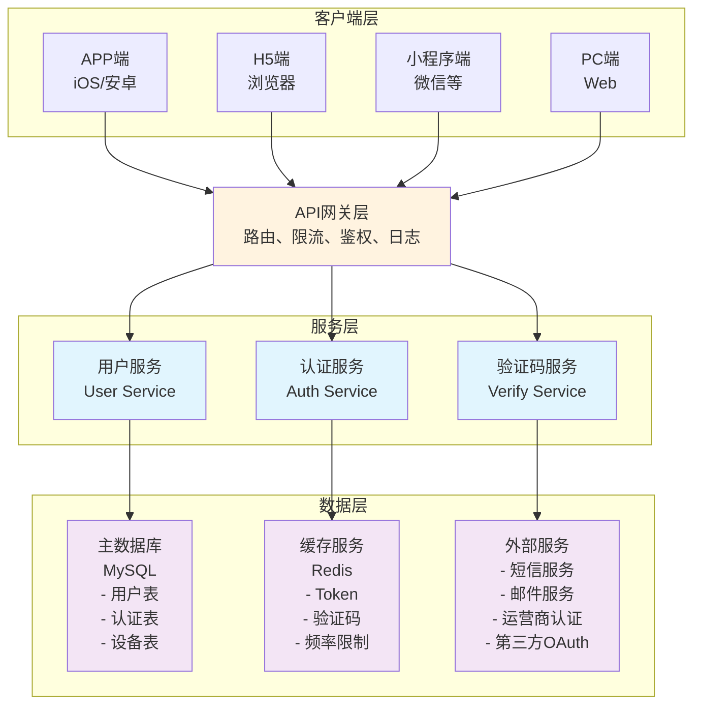

---

## 六、业务流程数据流转

### 6.1 注册流程数据流转

```
┌─────────────────────────────────────────────────────────────────┐
│                     注册流程数据流转                             │
└─────────────────────────────────────────────────────────────────┘

阶段1：手机号验证
┌──────────────┐     ┌──────────────┐     ┌──────────────┐
│   客户端     │────▶│   API网关    │────▶│  验证码服务  │
│  输入手机号  │     │  转发请求    │     │  生成验证码  │
└──────────────┘     └──────────────┘     └──────┬───────┘
                                                  │
                                                  ▼
                                           ┌──────────────┐
                                           │   短信服务   │
                                           │  发送验证码  │
                                           └──────────────┘

阶段2：验证码校验
┌──────────────┐     ┌──────────────┐     ┌──────────────┐
│   客户端     │────▶│   API网关    │────▶│  验证码服务  │
│  输入验证码  │     │  转发请求    │     │  校验验证码  │
└──────────────┘     └──────────────┘     └──────────────┘

阶段3：账号创建
┌──────────────┐     ┌──────────────┐     ┌──────────────┐
│   客户端     │────▶│   API网关    │────▶│   用户服务   │
│  提交注册    │     │  转发请求    │     │  创建账号    │
└──────────────┘     └──────────────┘     └──────┬───────┘
                                                  │
                                                  ▼
                                           ┌──────────────┐
                                           │   主数据库   │
                                           │  写入用户数据│
                                           └──────────────┘

阶段4：自动登录
┌──────────────┐     ┌──────────────┐     ┌──────────────┐
│   认证服务   │────▶│   缓存服务   │────▶│   客户端     │
│  生成Token   │     │  存储Token   │     │  接收Token   │
└──────────────┘     └──────────────┘     └──────────────┘
```

**Mermaid代码实现：**

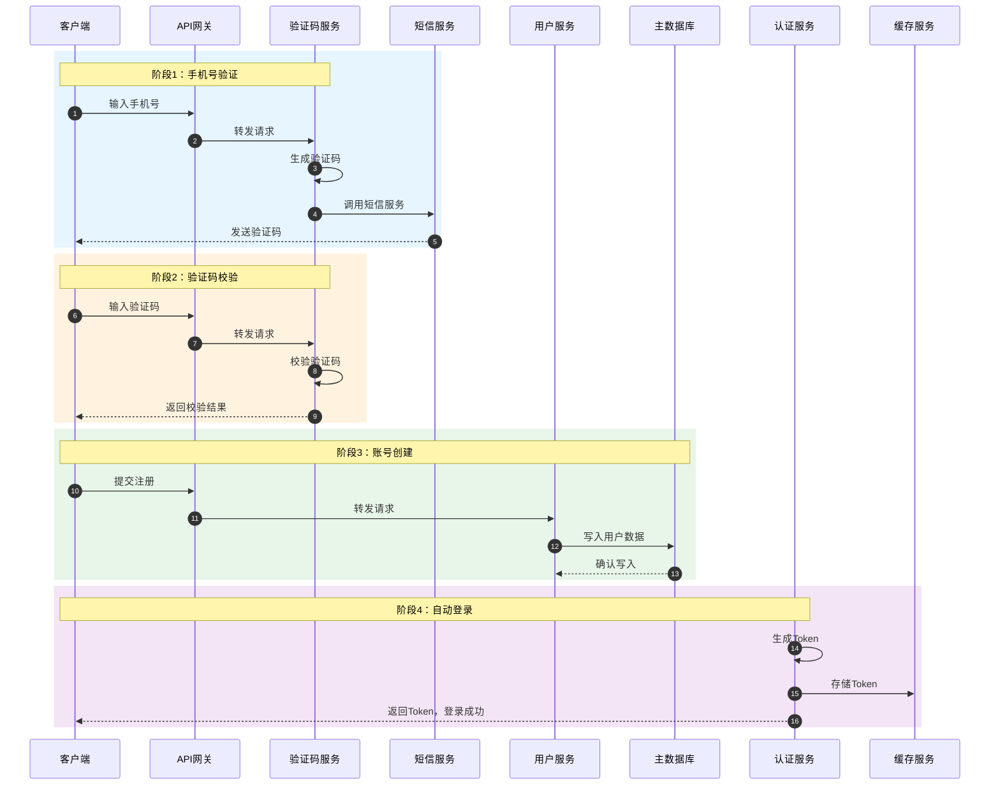

### 6.2 登录流程数据流转

```
┌─────────────────────────────────────────────────────────────────┐
│                     登录流程数据流转                             │
└─────────────────────────────────────────────────────────────────┘

阶段1：登录请求
┌──────────────┐     ┌──────────────┐     ┌──────────────┐
│   客户端     │────▶│   API网关    │────▶│   认证服务   │
│  提交登录    │     │  转发请求    │     │  校验账号    │
└──────────────┘     └──────────────┘     └──────┬───────┘
                                                  │
                                                  ▼
                                           ┌──────────────┐
                                           │   主数据库   │
                                           │  查询认证信息│
                                           └──────────────┘

阶段2：登录成功处理
┌──────────────┐     ┌──────────────┐     ┌──────────────┐
│   认证服务   │────▶│   缓存服务   │────▶│   用户服务   │
│  生成Token   │     │  存储Token   │     │  更新登录信息│
└──────────────┘     └──────────────┘     └──────────────┘

阶段3：返回客户端
┌──────────────┐     ┌──────────────┐     ┌──────────────┐
│   API网关    │────▶│   客户端     │────▶│   用户操作   │
│  返回Token   │     │  存储Token   │     │  进入首页    │
└──────────────┘     └──────────────┘     └──────────────┘
```

**Mermaid代码实现：**

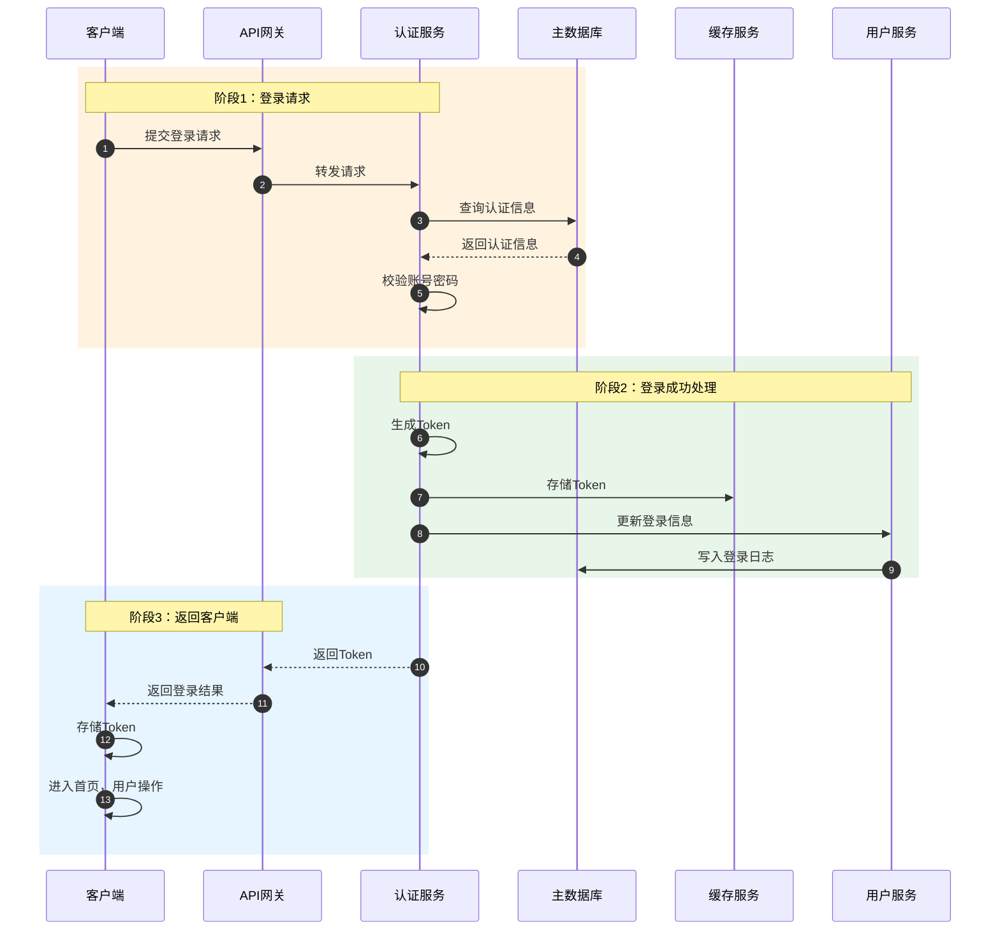

---

## 七、异常场景处理

### 7.1 常见异常场景

#### 7.1.1 网络异常
| 场景 | 用户反馈 | 系统处理 |
|-----|---------|---------|
| 网络断开 | 提示"网络连接失败，请检查网络" | 允许重试 |
| 请求超时 | 提示"请求超时，请稍后重试" | 记录日志，支持重试 |
| 服务器繁忙 | 提示"系统繁忙，请稍后重试" | 触发降级策略 |

#### 7.1.2 业务异常
| 场景 | 用户反馈 | 系统处理 |
|-----|---------|---------|
| 验证码发送失败 | 提示"验证码发送失败，请重试" | 记录失败原因 |
| 手机号已被注册 | 提示"该手机号已注册，请直接登录" | 提供登录入口 |
| 账号被冻结 | 提示"账号已被冻结" | 提供申诉入口 |
| Token失效 | 提示"登录已过期，请重新登录" | 引导重新登录 |

#### 7.1.3 安全异常
| 场景 | 用户反馈 | 系统处理 |
|-----|---------|---------|
| 密码错误次数过多 | 提示"密码错误次数过多，请30分钟后重试" | 锁定账号30分钟 |
| 异地登录 | 提示"检测到异常登录，请验证身份" | 触发安全验证 |
| 频繁操作 | 提示"操作过于频繁，请稍后再试" | 限制操作频率 |

### 7.2 降级策略

#### 7.2.1 短信服务降级
- **触发条件**：短信服务异常或超频
- **降级方案**：
  - 切换备用短信通道
  - 延长验证码有效期
  - 增加图形验证码作为替代方案

#### 7.2.2 第三方登录降级
- **触发条件**：第三方平台服务异常
- **降级方案**：
  - 提示用户"第三方登录服务暂不可用"
  - 引导使用手机号登录
  - 提供账号绑定入口

---

## 八、用户体验设计要点

### 8.1 注册流程优化

#### 8.1.1 减少操作步骤
- 默认展示手机号注册（最常用）
- 支持一键获取验证码（自动读取短信）
- 基础信息可选填写，支持跳过

#### 8.1.2 清晰的引导提示
- 每个输入框提供示例和格式要求
- 实时校验并反馈错误信息
- 提供密码强度可视化提示

#### 8.1.3 容错设计
- 验证码支持重新发送
- 支持返回上一步修改
- 保存已填写信息，避免重复输入

### 8.2 登录流程优化

#### 8.2.1 快捷登录
- 优先展示本机号码一键登录
- 记住上次登录方式
- 支持生物识别（指纹/面容）登录

#### 8.2.2 密码找回
- 提供"忘记密码"快速入口
- 支持多种找回方式（手机/邮箱/人工）
- 找回流程简洁明了

### 8.3 安全与便捷的平衡

#### 8.3.1 智能风控
- 信任设备免验证
- 常用地点免验证
- 异常行为才触发验证

#### 8.3.2 渐进式验证
- 根据风险等级选择验证方式
- 低风险：短信验证码
- 中风险：图形验证码+短信
- 高风险：人脸识别+短信

---

## 九、附录

### 9.1 术语表

| 术语 | 说明 |
|-----|------|
| Token | 用户登录态凭证，用于身份验证 |
| OpenID | 第三方平台的用户唯一标识 |
| 设备指纹 | 用于识别设备的唯一特征码 |
| 网关认证 | 运营商提供的本机号码认证服务 |
| OAuth | 开放授权协议，用于第三方登录 |

### 9.2 流程状态码

| 状态码 | 说明 |
|-------|------|
| 200 | 操作成功 |
| 400 | 请求参数错误 |
| 401 | 未授权/Token失效 |
| 403 | 账号被冻结/禁止访问 |
| 404 | 账号不存在 |
| 429 | 请求过于频繁 |
| 500 | 服务器内部错误 |

### 9.3 文档更新记录

| 版本 | 日期 | 更新内容 | 更新人 |
|-----|------|---------|-------|
| V1.0 | 2026-02-08 | 初始版本，完成注册登录业务流程说明 | - |

---

**文档结束**
