# 抖音电商浏览种草业务流程说明文档

## 文档信息

| 项目 | 内容 |
|------|------|
| 文档名称 | 浏览种草业务流程说明文档 |
| 适用场景 | 抖音电商 - 浏览种草阶段 |
| 文档版本 | V1.0 |
| 创建日期 | 2026-02-08 |
| 编写视角 | 业务视角（产品经理） |

---

## 目录

- [一、概述](#一概述)
  - [1.1 文档目的](#11-文档目的)
  - [1.2 适用范围](#12-适用范围)
  - [1.3 流程概览](#13-流程概览)
- [二、流量入口业务流程](#二流量入口业务流程)
  - [2.1 内容推荐流量](#21-内容推荐流量)
    - [2.1.1 流量来源](#211-流量来源)
    - [2.1.2 推荐算法触发流程](#212-推荐算法触发流程)
    - [2.1.3 内容推荐流量风险场景识别](#213-内容推荐流量风险场景识别)
    - [2.1.4 内容推荐流量风控策略](#214-内容推荐流量风控策略)
  - [2.2 主动搜索发现](#22-主动搜索发现)
    - [2.2.1 搜索入口](#221-搜索入口)
    - [2.2.2 搜索流程](#222-搜索流程)
    - [2.2.3 主动搜索发现风险场景识别](#223-主动搜索发现风险场景识别)
    - [2.2.4 主动搜索发现风控策略](#224-主动搜索发现风控策略)
  - [2.3 社交发现入口](#23-社交发现入口)
    - [2.3.1 社交触达方式](#231-社交触达方式)
    - [2.3.2 社交分享流程](#232-社交分享流程)
    - [2.3.3 社交发现入口风险场景识别](#233-社交发现入口风险场景识别)
    - [2.3.4 社交发现入口风控策略](#234-社交发现入口风控策略)
  - [2.4 活动入口引流](#24-活动入口引流)
    - [2.4.1 活动类型](#241-活动类型)
    - [2.4.2 活动入口引流风险场景识别](#242-活动入口引流风险场景识别)
    - [2.4.3 活动入口引流风控策略](#243-活动入口引流风控策略)
- [三、内容浏览业务流程](#三内容浏览业务流程)
  - [3.1 短视频浏览](#31-短视频浏览)
    - [3.1.1 短视频浏览流程](#311-短视频浏览流程)
    - [3.1.2 短视频互动操作](#312-短视频互动操作)
    - [3.1.3 短视频浏览风险场景识别](#313-短视频浏览风险场景识别)
    - [3.1.4 短视频浏览风控策略](#314-短视频浏览风控策略)
  - [3.2 直播浏览](#32-直播浏览)
    - [3.2.1 直播浏览流程](#321-直播浏览流程)
    - [3.2.2 直播间互动操作](#322-直播间互动操作)
    - [3.2.3 直播浏览风险场景识别](#323-直播浏览风险场景识别)
    - [3.2.4 直播浏览风控策略](#324-直播浏览风控策略)
  - [3.3 商品卡片浏览](#33-商品卡片浏览)
    - [3.3.1 商品卡片展示场景](#331-商品卡片展示场景)
    - [3.3.2 商品卡片浏览流程](#332-商品卡片浏览流程)
    - [3.3.3 商品卡片浏览风险场景识别](#333-商品卡片浏览风险场景识别)
    - [3.3.4 商品卡片浏览风控策略](#334-商品卡片浏览风控策略)
- [四、用户互动业务流程](#四用户互动业务流程)
  - [4.1 点赞互动](#41-点赞互动)
    - [4.1.1 点赞业务流程](#411-点赞业务流程)
    - [4.1.2 点赞互动风险场景识别](#412-点赞互动风险场景识别)
    - [4.1.3 点赞互动风控策略](#413-点赞互动风控策略)
  - [4.2 评论互动](#42-评论互动)
    - [4.2.1 评论业务流程](#421-评论业务流程)
    - [4.2.2 评论互动风险场景识别](#422-评论互动风险场景识别)
    - [4.2.3 评论互动风控策略](#423-评论互动风控策略)
  - [4.3 分享互动](#43-分享互动)
    - [4.3.1 分享业务流程](#431-分享业务流程)
    - [4.3.2 分享互动风险场景识别](#432-分享互动风险场景识别)
    - [4.3.3 分享互动风控策略](#433-分享互动风控策略)
  - [4.4 关注互动](#44-关注互动)
    - [4.4.1 关注业务流程](#441-关注业务流程)
    - [4.4.2 关注互动风险场景识别](#442-关注互动风险场景识别)
    - [4.4.3 关注互动风控策略](#443-关注互动风控策略)
- [五、商品意向业务流程](#五商品意向业务流程)
  - [5.1 点击商品查看详情](#51-点击商品查看详情)
    - [5.1.1 商品详情查看流程](#511-商品详情查看流程)
    - [5.1.2 商品详情查看风险场景识别](#512-商品详情查看风险场景识别)
    - [5.1.3 商品详情查看风控策略](#513-商品详情查看风控策略)
  - [5.2 商品收藏](#52-商品收藏)
    - [5.2.1 商品收藏流程](#521-商品收藏流程)
    - [5.2.2 商品收藏风险场景识别](#522-商品收藏风险场景识别)
    - [5.2.3 商品收藏风控策略](#523-商品收藏风控策略)
  - [5.3 加入购物车](#53-加入购物车)
    - [5.3.1 加入购物车流程](#531-加入购物车流程)
    - [5.3.2 加入购物车风险场景识别](#532-加入购物车风险场景识别)
    - [5.3.3 加入购物车风控策略](#533-加入购物车风控策略)
- [六、浏览种草阶段风险防控策略](#六浏览种草阶段风险防控策略)
  - [6.1 风险行为识别](#61-风险行为识别)
    - [6.1.1 流量作弊风险](#611-流量作弊风险)
    - [6.1.2 内容违规风险](#612-内容违规风险)
    - [6.1.3 恶意营销风险](#613-恶意营销风险)
    - [6.1.4 账号异常风险](#614-账号异常风险)
  - [6.2 风控介入策略](#62-风控介入策略)
    - [6.2.1 流量分发环节](#621-流量分发环节)
    - [6.2.2 内容互动环节](#622-内容互动环节)
    - [6.2.3 商品展示环节](#623-商品展示环节)
  - [6.3 风险识别能力](#63-风险识别能力)
    - [6.3.1 设备维度识别](#631-设备维度识别)
    - [6.3.2 行为维度识别](#632-行为维度识别)
    - [6.3.3 内容维度识别](#633-内容维度识别)
    - [6.3.4 关联维度识别](#634-关联维度识别)
  - [6.4 风险处置策略](#64-风险处置策略)
    - [6.4.1 风险分级体系](#641-风险分级体系)
    - [6.4.2 分级处置措施](#642-分级处置措施)
  - [6.5 误判处理机制](#65-误判处理机制)
    - [6.5.1 申诉渠道设计](#651-申诉渠道设计)
    - [6.5.2 审核机制](#652-审核机制)
    - [6.5.3 用户权益恢复](#653-用户权益恢复)
    - [6.5.4 误判预防优化](#654-误判预防优化)
- [七、相关文档链接](#七相关文档链接)
- [附录：风险场景清单](#附录风险场景清单)

---

## 一、概述

### 1.1 文档目的
本文档从纯业务视角详细描述抖音电商用户在浏览种草阶段的完整操作流程，包括用户行为序列、系统交互流程和涉及的服务组件，为后续风控策略设计提供业务基础。

### 1.2 适用范围
- 短视频/直播内容浏览流程
- 商品推荐流浏览流程
- 搜索发现流程
- 内容互动流程（点赞、评论、分享、关注）
- 商品收藏/加购前置流程

### 1.3 流程概览

```
┌─────────────────────────────────────────────────────────────────────────────┐
│                          浏览种草阶段业务流程                                │
├─────────────────────────────────────────────────────────────────────────────┤
│                                                                             │
│   ┌──────────┐    ┌──────────┐    ┌──────────┐    ┌──────────┐             │
│   │ 内容推荐 │    │ 主动搜索 │    │ 社交发现 │    │ 活动入口 │             │
│   │  流量    │    │  发现    │    │  入口    │    │  引流    │             │
│   └────┬─────┘    └────┬─────┘    └────┬─────┘    └────┬─────┘             │
│        │               │               │               │                   │
│        └───────────────┴───────┬───────┴───────────────┘                   │
│                                ▼                                            │
│   ┌──────────────────────────────────────────────────────────┐             │
│   │                    内容/商品浏览                          │             │
│   │  ┌──────────┐  ┌──────────┐  ┌──────────┐  ┌──────────┐ │             │
│   │  │ 短视频   │  │  直播    │  │ 商品卡片 │  │ 图文内容 │ │             │
│   │  └──────────┘  └──────────┘  └──────────┘  └──────────┘ │             │
│   └──────────────────────┬───────────────────────────────────┘             │
│                          │                                                  │
│                          ▼                                                  │
│   ┌──────────────────────────────────────────────────────────┐             │
│   │                    用户互动行为                           │             │
│   │  ┌──────────┐  ┌──────────┐  ┌──────────┐  ┌──────────┐ │             │
│   │  │  点赞    │  │  评论    │  │  分享    │  │  关注    │ │             │
│   │  └──────────┘  └──────────┘  └──────────┘  └──────────┘ │             │
│   └──────────────────────┬───────────────────────────────────┘             │
│                          │                                                  │
│                          ▼                                                  │
│   ┌──────────────────────────────────────────────────────────┐             │
│   │                    商品意向表达                           │             │
│   │  ┌──────────┐  ┌──────────┐  ┌──────────┐               │             │
│   │  │点击商品  │  │  收藏    │  │  加购    │               │             │
│   │  │查看详情  │  │  商品    │  │  商品    │               │             │
│   │  └──────────┘  └──────────┘  └──────────┘               │             │
│   └──────────────────────────────────────────────────────────┘             │
│                                                                             │
└─────────────────────────────────────────────────────────────────────────────┘
```

**Mermaid代码实现：**

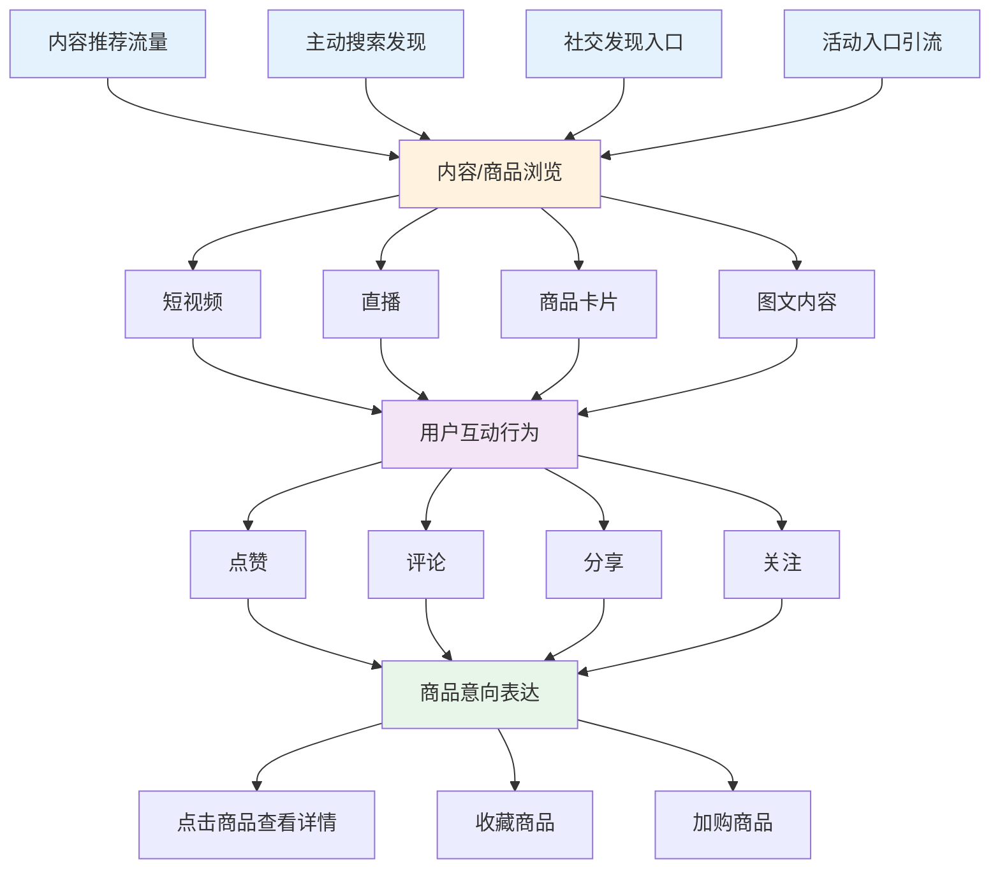

---

## 二、流量入口业务流程

### 2.1 内容推荐流量

#### 2.1.1 流量来源
| 流量来源 | 触达方式 | 内容形式 | 业务说明 |
|---------|---------|---------|---------|
| 推荐Feed流 | 打开APP默认展示 | 短视频/图文 | 基于用户兴趣的个性化推荐 |
| 关注Feed流 | 点击"关注"Tab | 短视频/直播 | 已关注创作者的内容 |
| 同城Feed流 | 点击"同城"Tab | 短视频/直播 | 基于地理位置的内容推荐 |
| 商城推荐流 | 点击"商城"Tab | 商品卡片 | 电商场景下的商品推荐 |

#### 2.1.2 推荐算法触发流程

```
┌─────────────────────────────────────────────────────────────┐
│                    个性化推荐触发流程                        │
├─────────────────────────────────────────────────────────────┤
│                                                             │
│  用户行为数据                                               │
│  ┌─────────┐ ┌─────────┐ ┌─────────┐ ┌─────────┐           │
│  │浏览历史 │ │互动记录 │ │搜索记录 │ │购买记录 │           │
│  └────┬────┘ └────┬────┘ └────┬────┘ └────┬────┘           │
│       └───────────┴───────────┴───────────┘                │
│                   │                                         │
│                   ▼                                         │
│       ┌─────────────────────┐                              │
│       │   用户画像构建      │                              │
│       │  - 兴趣标签         │                              │
│       │  - 消费能力         │                              │
│       │  - 活跃时段         │                              │
│       └──────────┬──────────┘                              │
│                  │                                          │
│                  ▼                                          │
│       ┌─────────────────────┐                              │
│       │   召回阶段          │                              │
│       │  - 协同过滤召回     │                              │
│       │  - 向量召回         │                              │
│       │  - 热门召回         │                              │
│       └──────────┬──────────┘                              │
│                  │                                          │
│                  ▼                                          │
│       ┌─────────────────────┐                              │
│       │   排序阶段          │                              │
│       │  - 粗排             │                              │
│       │  - 精排             │                              │
│       │  - 重排             │                              │
│       └──────────┬──────────┘                              │
│                  │                                          │
│                  ▼                                          │
│       ┌─────────────────────┐                              │
│       │   内容展示          │                              │
│       └─────────────────────┘                              │
│                                                             │
└─────────────────────────────────────────────────────────────┘
```

**Mermaid代码实现：**

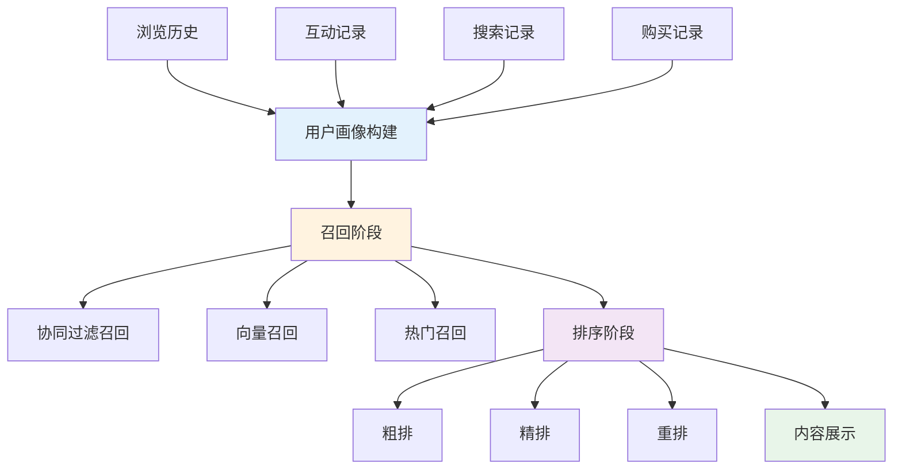

#### 2.1.3 内容推荐流量风险场景识别

| 风险场景 | 风险行为描述 | 识别维度 | 关键识别特征 | 风险等级 |
|---------|------------|---------|------------|---------|
| **推荐接口刷量** | 通过逆向工程破解推荐接口，批量获取推荐内容 | 设备维度 | 设备指纹异常；无正常APP渲染行为；直接调用API | 极高 |
| **虚假用户画像** | 伪造用户行为数据，操控推荐结果 | 行为维度 | 行为数据与真实用户差异大；行为序列规律性过强 | 高 |
| **内容刷量作弊** | 利用机器或众包方式刷内容播放量、互动量 | 行为维度 | 播放时长异常；互动行为模式化；设备/账号聚集 | 高 |
| **推荐结果劫持** | 通过技术手段干扰推荐算法，提升特定内容曝光 | 关联维度 | 异常流量来源；刷量团伙关联 | 高 |
| **恶意爬虫** | 批量抓取平台推荐内容数据 | 行为维度 | 访问频率异常；无正常用户行为；IP段聚集 | 中 |

#### 2.1.4 内容推荐流量风控策略

**风控介入节点：**

| 介入节点 | 风控策略 | 触发条件 | 处置方式 |
|---------|---------|---------|---------|
| 推荐请求校验 | 设备指纹校验+行为验证 | 设备信息异常 | 拒绝服务/要求验证 |
| 用户画像校验 | 行为数据真实性校验 | 行为数据异常 | 降级使用默认推荐 |
| 内容曝光监控 | 实时流量质量监控 | 内容流量异常增长 | 降权/人工审核 |
| 推荐结果审计 | 推荐日志审计分析 | 推荐结果异常 | 算法模型调优 |

**风险识别能力：**

| 识别能力 | 识别方法 | 应用场景 |
|---------|---------|---------|
| 设备真实性识别 | 设备指纹+环境检测 | 识别模拟器、虚拟机 |
| 行为真实性识别 | 行为序列分析+时序特征 | 识别机器刷量 |
| 流量异常检测 | 流量突增检测+来源分析 | 识别刷量攻击 |
| 团伙关联识别 | 设备/账号/IP关联分析 | 识别众包刷量 |

**风险处置措施：**

| 风险等级 | 处置措施 | 处置时效 |
|---------|---------|---------|
| 极高风险 | 拒绝推荐请求+封禁设备 | 实时 |
| 高风险 | 限制推荐频次+加强监控 | 实时 |
| 中风险 | 标记观察+日志记录 | 实时 |

---

### 2.2 主动搜索发现

#### 2.2.1 搜索入口
| 搜索入口 | 入口位置 | 触发方式 | 业务说明 |
|---------|---------|---------|---------|
| 顶部搜索框 | APP首页顶部 | 点击搜索图标 | 全局搜索入口 |
| 商城搜索框 | 商城页面顶部 | 点击搜索图标 | 电商垂直搜索 |
| 语音搜索 | 搜索框右侧 | 点击麦克风图标 | 语音输入搜索 |
| 拍照搜索 | 搜索框右侧 | 点击相机图标 | 以图搜商品 |

#### 2.2.2 搜索流程

```
┌─────────────────────────────────────────────────────────────┐
│                      用户搜索流程                            │
├─────────────────────────────────────────────────────────────┤
│                                                             │
│  ┌──────────┐                                               │
│  │ 点击搜索 │                                               │
│  │ 入口     │                                               │
│  └────┬─────┘                                               │
│       │                                                     │
│       ▼                                                     │
│  ┌──────────────────────────────────────────┐              │
│  │              搜索输入阶段                 │              │
│  │  ┌──────────┐ ┌──────────┐ ┌──────────┐ │              │
│  │  │ 文字输入 │ │ 语音输入 │ │ 图片上传 │ │              │
│  │  └──────────┘ └──────────┘ └──────────┘ │              │
│  └──────────────┬───────────────────────────┘              │
│                 │                                           │
│                 ▼                                           │
│  ┌──────────────────────────────────────────┐              │
│  │              搜索联想阶段                 │              │
│  │  - 搜索词补全                             │              │
│  │  - 热门搜索推荐                           │              │
│  │  - 历史搜索记录                           │              │
│  └──────────────┬───────────────────────────┘              │
│                 │                                           │
│                 ▼                                           │
│  ┌──────────────────────────────────────────┐              │
│  │              搜索结果展示                 │              │
│  │  ┌──────────┐ ┌──────────┐ ┌──────────┐ │              │
│  │  │ 综合结果 │ │ 商品结果 │ │ 内容结果 │ │              │
│  │  └──────────┘ └──────────┘ └──────────┘ │              │
│  └──────────────────────────────────────────┘              │
│                                                             │
└─────────────────────────────────────────────────────────────┘
```

**Mermaid代码实现：**

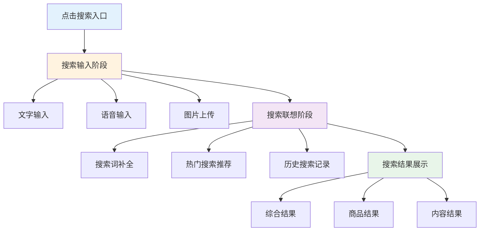

#### 2.2.3 主动搜索发现风险场景识别

| 风险场景 | 风险行为描述 | 识别维度 | 关键识别特征 | 风险等级 |
|---------|------------|---------|------------|---------|
| **搜索爬虫攻击** | 批量抓取搜索结果数据，用于竞品分析或数据贩卖 | 行为维度 | 搜索频率异常高；无点击行为；IP段聚集 | 高 |
| **搜索词注入** | 输入恶意搜索词，试图获取敏感信息或测试系统漏洞 | 内容维度 | 包含SQL注入、XSS等攻击特征；异常特殊字符 | 极高 |
| **搜索刷单** | 通过搜索特定关键词并点击，提升商品搜索排名 | 行为维度 | 搜索后立即点击；停留时间极短；行为模式化 | 高 |
| **虚假搜索联想** | 刷虚假搜索词，操控搜索联想推荐 | 行为维度 | 搜索词来源异常；短时间内大量搜索同一词汇 | 中 |
| **图片搜索滥用** | 上传违规图片进行以图搜图，试图获取相似违规内容 | 内容维度 | 图片包含违禁内容；批量上传相似图片 | 高 |

#### 2.2.4 主动搜索发现风控策略

**风控介入节点：**

| 介入节点 | 风控策略 | 触发条件 | 处置方式 |
|---------|---------|---------|---------|
| 搜索请求校验 | 频率限制+验证码 | 单位时间搜索次数异常 | 限制搜索+要求验证 |
| 搜索词审核 | 敏感词过滤+注入检测 | 搜索词包含风险特征 | 拦截请求+记录日志 |
| 搜索结果保护 | 反爬虫策略+数据脱敏 | 疑似爬虫行为 | 返回脱敏数据/拒绝服务 |
| 图片上传审核 | 图片内容审核 | 图片搜索上传 | 违规图片拦截 |

**风险识别能力：**

| 识别能力 | 识别方法 | 应用场景 |
|---------|---------|---------|
| 搜索行为分析 | 搜索频率+点击模式分析 | 识别搜索爬虫、刷单 |
| 搜索词安全检测 | 敏感词库+注入攻击检测 | 识别恶意搜索词 |
| 图片内容识别 | CV图像识别技术 | 识别违规图片搜索 |
| 设备行为关联 | 设备历史搜索行为分析 | 识别异常搜索模式 |

**风险处置措施：**

| 风险等级 | 处置措施 | 处置时效 |
|---------|---------|---------|
| 极高风险 | 拦截搜索请求+封禁IP/设备 | 实时 |
| 高风险 | 限制搜索频次+要求验证码 | 实时 |
| 中风险 | 标记监控+降低搜索配额 | 实时 |

---

### 2.3 社交发现入口

#### 2.3.1 社交触达方式
| 社交场景 | 触发方式 | 内容类型 | 业务说明 |
|---------|---------|---------|---------|
| 好友推荐 | 朋友点赞/购买 | 短视频/商品 | 基于社交关系的内容推荐 |
| 私信分享 | 好友发送链接 | 短视频/商品/直播间 | 点对点内容分享 |
| 群聊分享 | 群内分享内容 | 短视频/商品/直播间 | 群组内容传播 |
| 动态通知 | 关注创作者更新 | 短视频/直播预告 | 创作者内容推送 |

#### 2.3.2 社交分享流程

```
┌─────────────────────────────────────────────────────────────┐
│                      社交分享流程                            │
├─────────────────────────────────────────────────────────────┤
│                                                             │
│  分享发起方                    平台处理                      │
│  ┌──────────┐                ┌──────────┐                  │
│  │ 选择内容 │───────────────>│ 内容校验 │                  │
│  │ 点击分享 │                │ 链接生成 │                  │
│  └──────────┘                └────┬─────┘                  │
│                                   │                         │
│                                   ▼                         │
│                          ┌──────────────┐                  │
│                          │  分享渠道    │                  │
│                          │  - 私信      │                  │
│                          │  - 群聊      │                  │
│                          │  - 站外      │                  │
│                          └──────┬───────┘                  │
│                                 │                           │
│  分享接收方                     │                           │
│  ┌──────────┐                   │                           │
│  │ 接收分享 │<──────────────────┘                           │
│  │ 点击链接 │                                               │
│  └────┬─────┘                                               │
│       │                                                     │
│       ▼                                                     │
│  ┌──────────┐                                               │
│  │ 内容展示 │                                               │
│  │ 进入浏览 │                                               │
│  └──────────┘                                               │
│                                                             │
└─────────────────────────────────────────────────────────────┘
```

**Mermaid代码实现：**

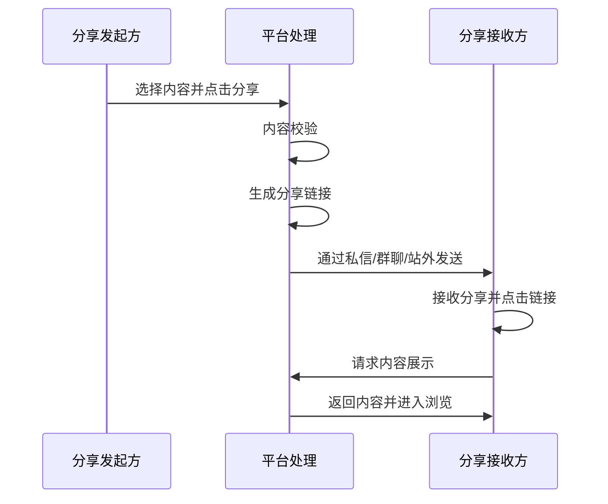

#### 2.3.3 社交发现入口风险场景识别

| 风险场景 | 风险行为描述 | 识别维度 | 关键识别特征 | 风险等级 |
|---------|------------|---------|------------|---------|
| **垃圾私信营销** | 批量发送营销广告私信给陌生用户 | 行为维度 | 私信频率异常高；内容包含广告特征；接收方投诉率高 | 高 |
| **恶意链接传播** | 分享包含钓鱼链接或恶意软件的内容 | 内容维度 | 链接指向站外风险域名；URL特征异常 | 极高 |
| **虚假社交关系** | 伪造好友关系进行诈骗或营销 | 关联维度 | 社交关系异常；账号间无真实互动 | 高 |
| **群聊广告轰炸** | 在群聊中批量发布广告信息 | 行为维度 | 短时间内发送大量相似内容；多群重复发送 | 中 |
| **诱导分享欺诈** | 以虚假奖励诱导用户分享违规内容 | 内容维度 | 分享内容包含欺诈承诺；奖励无法兑现 | 高 |
| **社交关系链攻击** | 利用社交关系链批量传播违规内容 | 关联维度 | 内容通过社交链快速传播；多层级扩散 | 高 |

#### 2.3.4 社交发现入口风控策略

**风控介入节点：**

| 介入节点 | 风控策略 | 触发条件 | 处置方式 |
|---------|---------|---------|---------|
| 分享内容审核 | 内容安全审核+链接检测 | 分享内容生成时 | 违规内容拦截；风险链接告警 |
| 私信频率控制 | 发送频率限制+内容审核 | 私信发送频率异常 | 限制发送+要求验证 |
| 社交关系验证 | 关系真实性校验 | 新建立社交关系 | 异常关系标记观察 |
| 链接安全检测 | URL安全扫描+域名黑名单 | 分享链接生成/点击 | 风险链接拦截/告警 |

**风险识别能力：**

| 识别能力 | 识别方法 | 应用场景 |
|---------|---------|---------|
| 私信行为分析 | 发送频率+内容模式分析 | 识别垃圾私信、营销轰炸 |
| 链接安全检测 | URL信誉库+实时扫描 | 识别钓鱼链接、恶意软件 |
| 社交图谱分析 | 关系网络分析+异常检测 | 识别虚假关系、团伙作案 |
| 内容传播监控 | 传播路径+速度分析 | 识别违规内容扩散 |

**风险处置措施：**

| 风险等级 | 处置措施 | 处置时效 |
|---------|---------|---------|
| 极高风险 | 拦截分享+封禁账号 | 实时 |
| 高风险 | 限制私信/分享功能+人工审核 | 实时 |
| 中风险 | 标记监控+降低功能配额 | 实时 |

---

### 2.4 活动入口引流

#### 2.4.1 活动类型
| 活动类型 | 触达方式 | 活动形式 | 业务说明 |
|---------|---------|---------|---------|
| 平台大促 | 首页Banner/弹窗 | 618/双11/年货节 | 大型促销活动 |
| 品类活动 | 频道页入口 | 美妆节/数码节 | 垂直品类促销 |
| 直播间活动 | 直播间入口 | 限时秒杀/抽奖 | 直播专属活动 |
| 新人专享 | 新人引导页 | 新人优惠券/特价 | 新用户转化活动 |

#### 2.4.2 活动入口引流风险场景识别

| 风险场景 | 风险行为描述 | 识别维度 | 关键识别特征 | 风险等级 |
|---------|------------|---------|------------|---------|
| **活动薅羊毛** | 批量注册新账号领取新人专享优惠 | 账号维度 | 设备/IP聚集；注册后仅参与活动；无正常购物行为 | 高 |
| **虚假活动引流** | 创建虚假活动页面诱导用户点击 | 内容维度 | 活动页面仿冒官方；奖品虚假承诺；引导站外交易 | 极高 |
| **活动作弊** | 利用技术手段批量抢购限量商品/优惠券 | 行为维度 | 请求频率异常；自动化脚本特征；多账号协同 | 极高 |
| **活动数据造假** | 刷活动参与人数、互动数据制造虚假热度 | 行为维度 | 参与行为模式化；设备/账号聚集；互动数据异常 | 高 |
| **恶意弹窗劫持** | 通过技术手段劫持活动弹窗展示违规内容 | 技术维度 | 弹窗内容被篡改；非官方活动链接；恶意重定向 | 极高 |
| **黄牛囤货** | 利用活动低价批量购买商品后高价转售 | 行为维度 | 同一收货地址多订单；购买数量异常；收货信息相似 | 高 |

#### 2.4.3 活动入口引流风控策略

**风控介入节点：**

| 介入节点 | 风控策略 | 触发条件 | 处置方式 |
|---------|---------|---------|---------|
| 活动参与校验 | 设备/账号风险校验+行为验证 | 参与活动时 | 风险账号拦截/要求验证 |
| 优惠券发放风控 | 领取频率限制+账号资质审核 | 领取优惠券时 | 限制领取/人工审核 |
| 秒杀抢购风控 | 请求频率控制+反作弊验证 | 秒杀开始时 | 限流/验证码/排队机制 |
| 活动数据监控 | 实时数据异常监控 | 活动数据异常波动 | 自动告警/人工介入 |
| 活动页面安全 | 页面内容审核+链接安全检测 | 活动页面上线前 | 违规内容拦截 |

**风险识别能力：**

| 识别能力 | 识别方法 | 应用场景 |
|---------|---------|---------|
| 薅羊毛识别 | 账号行为模式+设备关联分析 | 识别批量注册领优惠 |
| 作弊行为识别 | 请求特征分析+行为序列检测 | 识别自动化抢购脚本 |
| 黄牛识别 | 收货地址聚类+购买模式分析 | 识别囤货转售行为 |
| 虚假活动识别 | 页面内容审核+链接安全检测 | 识别钓鱼活动页面 |

**风险处置措施：**

| 风险等级 | 处置措施 | 处置时效 |
|---------|---------|---------|
| 极高风险 | 拦截参与+取消资格+封禁账号 | 实时 |
| 高风险 | 限制参与次数+加强审核+延迟发货 | 实时 |
| 中风险 | 标记观察+限制活动权益 | 实时 |

---

## 三、内容浏览业务流程

### 3.1 短视频浏览

#### 3.1.1 短视频浏览流程

```
┌─────────────────────────────────────────────────────────────┐
│                      短视频浏览流程                          │
├─────────────────────────────────────────────────────────────┤
│                                                             │
│  ┌──────────┐                                               │
│  │ 进入推荐 │                                               │
│  │ Feed流   │                                               │
│  └────┬─────┘                                               │
│       │                                                     │
│       ▼                                                     │
│  ┌──────────────────────────────────────────┐              │
│  │              视频播放阶段                 │              │
│  │  - 自动播放                               │              │
│  │  - 循环播放                               │              │
│  │  - 上滑/下滑切换                          │              │
│  └──────────────┬───────────────────────────┘              │
│                 │                                           │
│                 ▼                                           │
│  ┌──────────────────────────────────────────┐              │
│  │              用户观看行为                 │              │
│  │  ┌──────────┐ ┌──────────┐ ┌──────────┐ │              │
│  │  │ 完整观看 │ │ 部分观看 │ │ 快速划过 │ │              │
│  │  └──────────┘ └──────────┘ └──────────┘ │              │
│  └──────────────┬───────────────────────────┘              │
│                 │                                           │
│                 ▼                                           │
│  ┌──────────────────────────────────────────┐              │
│  │              内容互动操作                 │              │
│  │  ┌──────────┐ ┌──────────┐ ┌──────────┐ │              │
│  │  │ 点赞     │ │ 评论     │ │ 分享     │ │              │
│  │  └──────────┘ └──────────┘ └──────────┘ │              │
│  └──────────────┬───────────────────────────┘              │
│                 │                                           │
│                 ▼                                           │
│  ┌──────────────────────────────────────────┐              │
│  │              商品转化入口                 │              │
│  │  ┌──────────┐ ┌──────────┐ ┌──────────┐ │              │
│  │  │ 购物车   │ │ 商品橱窗 │ │ 评论区   │ │              │
│  │  │ 图标     │ │ 入口     │ │ 蓝链     │ │              │
│  │  └──────────┘ └──────────┘ └──────────┘ │              │
│  └──────────────────────────────────────────┘              │
│                                                             │
└─────────────────────────────────────────────────────────────┘
```

**Mermaid代码实现：**

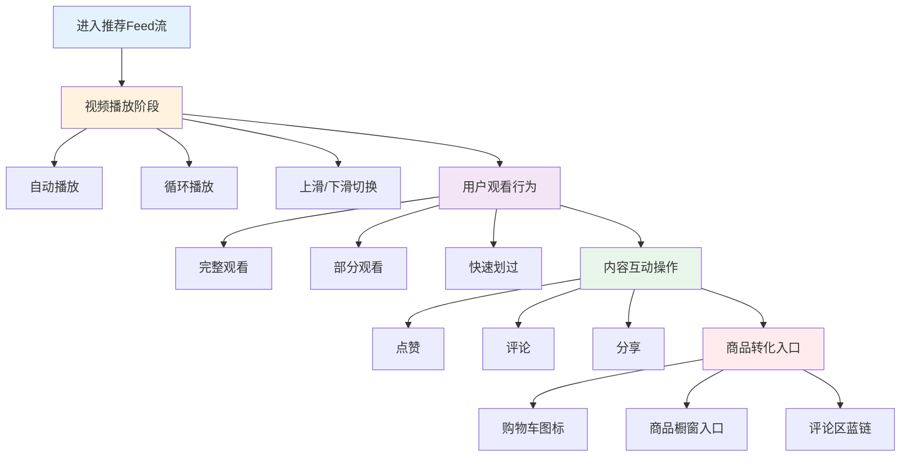

#### 3.1.2 短视频互动操作
| 互动类型 | 操作方式 | 功能说明 | 业务价值 |
|---------|---------|---------|---------|
| 点赞 | 双击屏幕/点击心形图标 | 表达对内容的喜爱 | 内容质量反馈信号 |
| 评论 | 点击评论图标输入文字 | 发表对内容的看法 | 用户参与度指标 |
| 分享 | 点击分享图标选择渠道 | 将内容分享给他人 | 内容传播扩散 |
| 收藏 | 点击收藏图标 | 保存感兴趣的内容 | 用户兴趣标记 |
| 关注 | 点击头像旁关注按钮 | 关注内容创作者 | 创作者粉丝增长 |

#### 3.1.3 短视频浏览风险场景识别

| 风险场景 | 风险行为描述 | 识别维度 | 关键识别特征 | 风险等级 |
|---------|------------|---------|------------|---------|
| **机器刷播放** | 使用自动化脚本模拟视频播放，提升播放量数据 | 行为维度 | 播放时长异常短；无真实观看行为；播放完成率异常 | 高 |
| **虚假互动** | 批量制造虚假点赞、评论数据 | 行为维度 | 互动行为模式化；账号/设备聚集；互动内容与视频无关 | 高 |
| **内容搬运** | 盗用他人原创视频内容，冒充原创发布 | 内容维度 | 视频内容相似度高；发布时间晚于原创；水印/标识被去除 | 高 |
| **诱导点击** | 使用标题党、封面党诱导用户点击，实际内容不符 | 内容维度 | 标题与内容严重不符；封面使用夸张图片；用户跳出率高 | 中 |
| **恶意引流** | 在视频内容或评论区诱导用户点击恶意链接 | 内容维度 | 包含站外链接；引导添加联系方式；链接指向风险域名 | 极高 |
| **刷量工作室** | 组织真人或机器进行批量刷量、刷互动 | 关联维度 | 多设备地理位置聚集；行为时间高度同步；账号关联性强 | 高 |

#### 3.1.4 短视频浏览风控策略

**风控介入节点：**

| 介入节点 | 风控策略 | 触发条件 | 处置方式 |
|---------|---------|---------|---------|
| 视频播放校验 | 播放行为真实性检测 | 播放数据异常 | 过滤虚假播放数据 |
| 互动行为监控 | 点赞/评论频率限制+内容审核 | 互动频率异常 | 限制互动功能/拦截虚假互动 |
| 内容相似度检测 | 视频指纹比对+内容查重 | 新视频上传 | 搬运内容拦截/降权 |
| 内容质量评估 | 标题-内容一致性检测 | 视频发布时 | 标题党内容降权 |
| 链接安全检测 | URL安全扫描+域名黑名单 | 检测到链接 | 风险链接拦截/告警 |

**风险识别能力：**

| 识别能力 | 识别方法 | 应用场景 |
|---------|---------|---------|
| 播放真实性识别 | 播放行为分析+设备环境检测 | 识别机器刷播放 |
| 互动真实性识别 | 互动行为模式分析+账号关联 | 识别虚假互动 |
| 视频指纹识别 | 视频特征提取+相似度比对 | 识别搬运、抄袭内容 |
| 内容质量识别 | 标题-内容匹配度分析+用户反馈 | 识别标题党、低质内容 |

**风险处置措施：**

| 风险等级 | 处置措施 | 处置时效 |
|---------|---------|---------|
| 极高风险 | 视频下架+账号封禁 | 实时 |
| 高风险 | 视频降权/限流+账号警告 | 实时 |
| 中风险 | 标记观察+降低推荐权重 | 实时 |

---

### 3.2 直播浏览

#### 3.2.1 直播浏览流程

```
┌─────────────────────────────────────────────────────────────┐
│                       直播浏览流程                           │
├─────────────────────────────────────────────────────────────┤
│                                                             │
│  ┌──────────┐                                               │
│  │ 进入直播 │                                               │
│  │ 间/推荐  │                                               │
│  └────┬─────┘                                               │
│       │                                                     │
│       ▼                                                     │
│  ┌──────────────────────────────────────────┐              │
│  │              直播间展示                   │              │
│  │  ┌──────────┐ ┌──────────┐ ┌──────────┐ │              │
│  │  │ 直播画面 │ │ 主播信息 │ │ 商品列表 │ │              │
│  │  │ 区域     │ │ 区域     │ │ 区域     │ │              │
│  │  └──────────┘ └──────────┘ └──────────┘ │              │
│  └──────────────┬───────────────────────────┘              │
│                 │                                           │
│                 ▼                                           │
│  ┌──────────────────────────────────────────┐              │
│  │              直播间互动                   │              │
│  │  ┌──────────┐ ┌──────────┐ ┌──────────┐ │              │
│  │  │ 弹幕评论 │ │ 点赞送礼 │ │ 商品点击 │ │              │
│  │  └──────────┘ └──────────┘ └──────────┘ │              │
│  └──────────────┬───────────────────────────┘              │
│                 │                                           │
│                 ▼                                           │
│  ┌──────────────────────────────────────────┐              │
│  │              直播参与活动                 │              │
│  │  ┌──────────┐ ┌──────────┐ ┌──────────┐ │              │
│  │  │ 限时秒杀 │ │ 抽奖活动 │ │ 优惠券   │ │              │
│  │  └──────────┘ └──────────┘ └──────────┘ │              │
│  └──────────────────────────────────────────┘              │
│                                                             │
└─────────────────────────────────────────────────────────────┘
```

**Mermaid代码实现：**

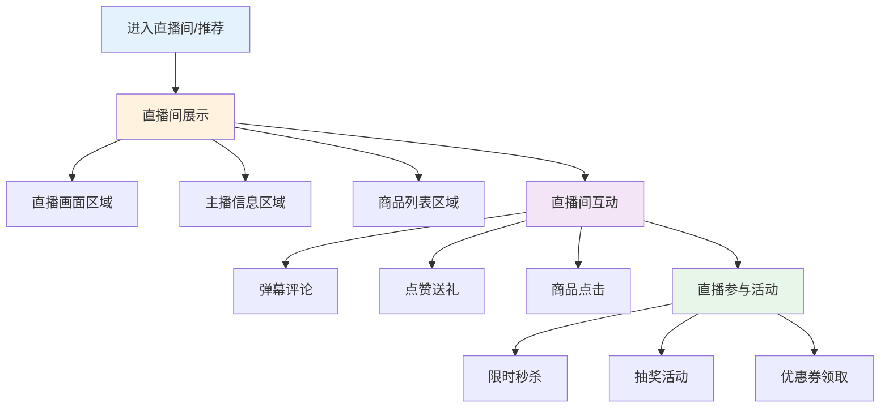

#### 3.2.2 直播间互动操作
| 互动类型 | 操作方式 | 功能说明 | 业务价值 |
|---------|---------|---------|---------|
| 弹幕评论 | 输入文字发送 | 与主播/其他观众互动 | 直播间活跃度 |
| 点赞 | 点击点赞图标 | 支持主播 | 直播间热度指标 |
| 送礼物 | 选择礼物并赠送 | 打赏主播 | 主播收入/平台收益 |
| 关注主播 | 点击关注按钮 | 关注直播间主播 | 主播粉丝增长 |
| 分享直播间 | 点击分享图标 | 邀请好友观看 | 直播间流量增长 |

#### 3.2.3 直播浏览风险场景识别

| 风险场景 | 风险行为描述 | 识别维度 | 关键识别特征 | 风险等级 |
|---------|------------|---------|------------|---------|
| **直播刷量** | 使用机器或众包方式刷直播间观看人数、点赞数 | 行为维度 | 观看人数与互动比例异常；弹幕内容模式化；设备/账号聚集 | 高 |
| **虚假送礼** | 通过非法渠道获取虚拟货币送礼，或利用漏洞刷礼物数据 | 行为维度 | 送礼账号异常；支付渠道异常；礼物数据与收入不符 | 极高 |
| **直播内容违规** | 直播中出现违禁品展示、虚假宣传、低俗内容等 | 内容维度 | 直播画面出现违禁商品；主播言语违规；用户举报率高 | 极高 |
| **弹幕刷屏** | 在直播间批量发送广告、违规信息或恶意刷屏 | 行为维度 | 弹幕频率异常高；内容重复或相似；多账号协同发送 | 中 |
| **诱导打赏** | 主播通过虚假承诺、情感绑架等方式诱导用户过度打赏 | 内容维度 | 主播言语诱导性强；承诺无法兑现；用户投诉举报 | 高 |
| **直播诈骗** | 以直播形式进行虚假商品销售、虚假抽奖等诈骗行为 | 内容维度 | 商品信息虚假；抽奖结果不透明；用户投诉退款率高 | 极高 |

#### 3.2.4 直播浏览风控策略

**风控介入节点：**

| 介入节点 | 风控策略 | 触发条件 | 处置方式 |
|---------|---------|---------|---------|
| 直播间实时监控 | AI内容审核+人工巡查 | 直播进行中 | 违规内容实时告警/断流 |
| 弹幕实时审核 | 敏感词过滤+频率限制 | 弹幕发送时 | 违规弹幕拦截/发送者限制 |
| 送礼行为监控 | 送礼频率限制+支付风控 | 送礼行为异常 | 限制送礼/账号验证 |
| 观看数据监控 | 实时流量质量分析 | 观看数据异常 | 过滤虚假流量/降权 |
| 主播行为监控 | 主播言语行为分析 | 主播违规诱导 | 警告/断流/封禁 |

**风险识别能力：**

| 识别能力 | 识别方法 | 应用场景 |
|---------|---------|---------|
| 直播内容识别 | 实时视频分析+语音识别 | 识别违规直播内容 |
| 弹幕内容识别 | NLP文本审核+模式识别 | 识别违规弹幕、刷屏 |
| 送礼行为识别 | 支付风控+行为分析 | 识别虚假送礼、洗钱 |
| 观看真实性识别 | 行为分析+设备检测 | 识别机器刷观看 |

**风险处置措施：**

| 风险等级 | 处置措施 | 处置时效 |
|---------|---------|---------|
| 极高风险 | 立即断流+封禁直播间+账号处罚 | 实时 |
| 高风险 | 警告主播+限制功能+加强监控 | 实时 |
| 中风险 | 标记观察+降低推荐权重 | 实时 |

---

### 3.3 商品卡片浏览

#### 3.3.1 商品卡片展示场景
| 展示场景 | 卡片形式 | 触发方式 | 业务说明 |
|---------|---------|---------|---------|
| 商城推荐流 | 商品卡片 | 上下滑动浏览 | 商品信息流展示 |
| 搜索结果页 | 商品列表 | 搜索后展示 | 搜索商品结果 |
| 店铺主页 | 商品网格 | 进入店铺 | 店铺商品展示 |
| 活动页面 | 促销卡片 | 进入活动页 | 活动商品推荐 |

#### 3.3.2 商品卡片浏览流程

```
┌─────────────────────────────────────────────────────────────┐
│                      商品卡片浏览流程                        │
├─────────────────────────────────────────────────────────────┤
│                                                             │
│  ┌──────────┐                                               │
│  │ 进入商品 │                                               │
│  │ 展示页面 │                                               │
│  └────┬─────┘                                               │
│       │                                                     │
│       ▼                                                     │
│  ┌──────────────────────────────────────────┐              │
│  │              商品卡片展示                 │              │
│  │  ┌──────────┐ ┌──────────┐ ┌──────────┐ │              │
│  │  │ 商品主图 │ │ 商品标题 │ │ 价格信息 │ │              │
│  │  └──────────┘ └──────────┘ └──────────┘ │              │
│  │  ┌──────────┐ ┌──────────┐ ┌──────────┐ │              │
│  │  │ 销量信息 │ │ 店铺信息 │ │ 活动标签 │ │              │
│  │  └──────────┘ └──────────┘ └──────────┘ │              │
│  └──────────────┬───────────────────────────┘              │
│                 │                                           │
│                 ▼                                           │
│  ┌──────────────────────────────────────────┐              │
│  │              用户浏览行为                 │              │
│  │  ┌──────────┐ ┌──────────┐ ┌──────────┐ │              │
│  │  │ 滑动浏览 │ │ 点击卡片 │ │ 筛选排序 │ │              │
│  │  └──────────┘ └──────────┘ └──────────┘ │              │
│  └──────────────┬───────────────────────────┘              │
│                 │                                           │
│                 ▼                                           │
│  ┌──────────────────────────────────────────┐              │
│  │              商品操作入口                 │              │
│  │  ┌──────────┐ ┌──────────┐ ┌──────────┐ │              │
│  │  │ 查看详情 │ │ 加入购物车│ │ 立即购买 │ │              │
│  │  └──────────┘ └──────────┘ └──────────┘ │              │
│  └──────────────────────────────────────────┘              │
│                                                             │
└─────────────────────────────────────────────────────────────┘
```

**Mermaid代码实现：**

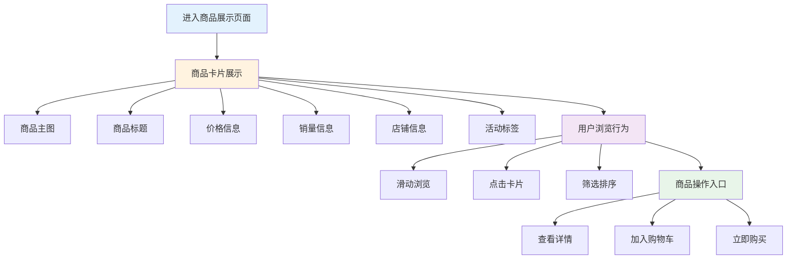

#### 3.3.3 商品卡片浏览风险场景识别

| 风险场景 | 风险行为描述 | 识别维度 | 关键识别特征 | 风险等级 |
|---------|------------|---------|------------|---------|
| **虚假商品信息** | 商品标题、图片、价格等信息虚假或误导消费者 | 内容维度 | 商品描述与实际不符；价格异常低廉；图片盗用或PS | 高 |
| **违禁品展示** | 在商品卡片中展示法律法规禁止销售的商品 | 内容维度 | 商品类目违规；关键词敏感；图片出现违禁品 | 极高 |
| **销量数据造假** | 通过刷单手段制造虚假销量数据，误导消费者 | 行为维度 | 销量与评价比例异常；购买行为模式化；设备/账号聚集 | 高 |
| **恶意比价爬虫** | 批量抓取平台商品价格和库存数据 | 行为维度 | 访问频率异常；无正常用户行为；IP段聚集 | 中 |
| **商品信息爬取** | 批量抓取商品详情用于竞品分析或数据贩卖 | 行为维度 | 高频访问商品详情页；无加购/购买行为；请求特征异常 | 中 |
| **虚假宣传** | 使用夸大、虚假的宣传语描述商品功效 | 内容维度 | 功效描述夸大；使用绝对化用语；医疗/保健违规宣传 | 高 |

#### 3.3.4 商品卡片浏览风控策略

**风控介入节点：**

| 介入节点 | 风控策略 | 触发条件 | 处置方式 |
|---------|---------|---------|---------|
| 商品信息审核 | 图文内容审核+关键词过滤 | 商品上架/更新时 | 违规商品拦截/要求整改 |
| 销量数据监控 | 销量真实性校验+刷单识别 | 销量数据异常增长 | 过滤虚假销量/店铺处罚 |
| 价格监控 | 价格异常检测+比价保护 | 价格异常波动 | 价格审核/异常告警 |
| 访问行为监控 | 反爬虫策略+频率限制 | 访问行为异常 | 限制访问/验证码验证 |
| 商品质量评估 | 用户反馈分析+退货率监控 | 商品质量投诉高 | 商品降权/下架 |

**风险识别能力：**

| 识别能力 | 识别方法 | 应用场景 |
|---------|---------|---------|
| 商品内容识别 | 图文审核+OCR识别+关键词匹配 | 识别虚假/违规商品信息 |
| 销量真实性识别 | 购买行为分析+账号关联分析 | 识别刷单造假 |
| 价格异常识别 | 价格波动分析+市场比价 | 识别价格欺诈 |
| 爬虫行为识别 | 请求特征分析+行为模式识别 | 识别数据爬取 |

**风险处置措施：**

| 风险等级 | 处置措施 | 处置时效 |
|---------|---------|---------|
| 极高风险 | 商品立即下架+店铺处罚+账号封禁 | 实时 |
| 高风险 | 商品降权/限流+要求整改+加强监控 | 实时 |
| 中风险 | 标记观察+降低搜索排名 | 实时 |

---

## 四、用户互动业务流程

### 4.1 点赞互动

#### 4.1.1 点赞业务流程

```
┌─────────────────────────────────────────────────────────────┐
│                        点赞业务流程                          │
├─────────────────────────────────────────────────────────────┤
│                                                             │
│  ┌──────────┐                                               │
│  │ 浏览内容 │                                               │
│  │ 产生兴趣 │                                               │
│  └────┬─────┘                                               │
│       │                                                     │
│       ▼                                                     │
│  ┌──────────────────────────────────────────┐              │
│  │              点赞操作                     │              │
│  │  ┌──────────┐ ┌──────────┐ ┌──────────┐ │              │
│  │  │ 双击屏幕 │ │ 点击心形 │ │ 长按点赞 │ │              │
│  │  │ （视频） │ │ 图标     │ │ （特效） │ │              │
│  │  └──────────┘ └──────────┘ └──────────┘ │              │
│  └──────────────┬───────────────────────────┘              │
│                 │                                           │
│                 ▼                                           │
│  ┌──────────────────────────────────────────┐              │
│  │              系统处理                     │              │
│  │  - 点赞数+1                               │              │
│  │  - 记录用户行为                           │              │
│  │  - 触发推荐算法                           │              │
│  └──────────────┬───────────────────────────┘              │
│                 │                                           │
│                 ▼                                           │
│  ┌──────────────────────────────────────────┐              │
│  │              反馈展示                     │              │
│  │  - 心形动画                               │              │
│  │  - 点赞数更新                             │              │
│  │  - 已点赞状态标记                         │              │
│  └──────────────────────────────────────────┘              │
│                                                             │
└─────────────────────────────────────────────────────────────┘
```

**Mermaid代码实现：**

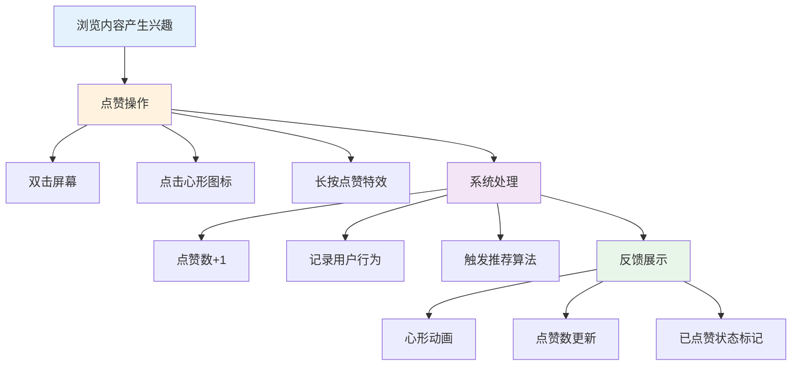

#### 4.1.2 点赞互动风险场景识别

| 风险场景 | 风险行为描述 | 识别维度 | 关键识别特征 | 风险等级 |
|---------|------------|---------|------------|---------|
| **机器刷赞** | 使用自动化脚本批量点赞，提升内容热度 | 行为维度 | 点赞频率异常高；无浏览行为直接点赞；设备/账号聚集 | 高 |
| **点赞诈骗** | 以"点赞返利""点赞赚钱"等名义进行诈骗 | 内容维度 | 评论/私信诱导点赞；承诺点赞返现；引导添加联系方式 | 极高 |
| **虚假点赞交易** | 买卖点赞服务，人为操控内容热度 | 关联维度 | 异常点赞来源；点赞账号行为模式化；付费痕迹 | 高 |
| **诱导点赞** | 通过虚假承诺诱导用户点赞（如"点赞送礼品"） | 内容维度 | 内容中包含诱导点赞话术；承诺无法兑现；用户投诉 | 中 |
| **恶意刷赞攻击** | 对竞品内容进行恶意刷赞后举报，试图让平台降权 | 行为维度 | 对特定账号集中点赞；点赞后伴随举报行为；行为异常 | 中 |

#### 4.1.3 点赞互动风控策略

**风控介入节点：**

| 介入节点 | 风控策略 | 触发条件 | 处置方式 |
|---------|---------|---------|---------|
| 点赞请求校验 | 点赞频率限制+行为验证 | 点赞频率异常 | 限制点赞/要求验证 |
| 点赞来源审核 | 账号资质校验+行为分析 | 新账号/异常账号点赞 | 过滤异常点赞数据 |
| 点赞内容监控 | 诱导点赞内容识别 | 内容包含诱导话术 | 内容降权/删除 |
| 点赞数据审计 | 点赞数据真实性校验 | 点赞数据异常波动 | 过滤虚假点赞 |

**风险识别能力：**

| 识别能力 | 识别方法 | 应用场景 |
|---------|---------|---------|
| 点赞行为识别 | 频率分析+时序特征+设备检测 | 识别机器刷赞 |
| 诱导内容识别 | NLP文本识别+模式匹配 | 识别诱导点赞话术 |
| 账号关联分析 | 点赞账号关系网络分析 | 识别刷赞团伙 |
| 点赞质量评估 | 点赞者行为质量分析 | 识别低质量点赞 |

**风险处置措施：**

| 风险等级 | 处置措施 | 处置时效 |
|---------|---------|---------|
| 极高风险 | 拦截点赞+封禁账号+删除诱导内容 | 实时 |
| 高风险 | 限制点赞功能+过滤虚假点赞数据 | 实时 |
| 中风险 | 标记监控+降低点赞权重 | 实时 |

---

### 4.2 评论互动

#### 4.2.1 评论业务流程

```
┌─────────────────────────────────────────────────────────────┐
│                       评论业务流程                           │
├─────────────────────────────────────────────────────────────┤
│                                                             │
│  ┌──────────┐                                               │
│  │ 浏览内容 │                                               │
│  │ 想要评论 │                                               │
│  └────┬─────┘                                               │
│       │                                                     │
│       ▼                                                     │
│  ┌──────────────────────────────────────────┐              │
│  │              进入评论界面                 │              │
│  │  - 点击评论图标                           │              │
│  │  - 查看已有评论                           │              │
│  │  - 热门评论展示                           │              │
│  └──────────────┬───────────────────────────┘              │
│                 │                                           │
│                 ▼                                           │
│  ┌──────────────────────────────────────────┐              │
│  │              评论输入                     │              │
│  │  ┌──────────┐ ┌──────────┐ ┌──────────┐ │              │
│  │  │ 文字输入 │ │ 表情选择 │ │ @用户    │ │              │
│  │  └──────────┘ └──────────┘ └──────────┘ │              │
│  └──────────────┬───────────────────────────┘              │
│                 │                                           │
│                 ▼                                           │
│  ┌──────────────────────────────────────────┐              │
│  │              评论发布                     │              │
│  │  - 内容审核                               │              │
│  │  - 发布成功                               │              │
│  │  - 展示在评论区                           │              │
│  └──────────────────────────────────────────┘              │
│                                                             │
└─────────────────────────────────────────────────────────────┘
```

**Mermaid代码实现：**

```mermaid
flowchart TD
    A[浏览内容想要评论] --> B[进入评论界面]
    B --> B1[点击评论图标]
    B --> B2[查看已有评论]
    B --> B3[热门评论展示]
    
    B --> C[评论输入]
    C --> C1[文字输入]
    C --> C2[表情选择]
    C --> C3[@用户]
    
    C --> D[评论发布]
    D --> D1[内容审核]
    D --> D2[发布成功]
    D --> D3[展示在评论区]
    
    style A fill:#e3f2fd
    style B fill:#fff3e0
    style C fill:#f3e5f5
    style D fill:#e8f5e9
```

#### 4.2.2 评论互动风险场景识别

| 风险场景 | 风险行为描述 | 识别维度 | 关键识别特征 | 风险等级 |
|---------|------------|---------|------------|---------|
| **垃圾广告评论** | 在评论区批量发布广告信息、联系方式 | 内容维度 | 评论包含广告关键词；引导添加微信/QQ；批量发送相似内容 | 高 |
| **恶意评论攻击** | 组织水军对特定账号进行恶意差评、人身攻击 | 行为维度 | 评论内容负面集中；账号行为模式化；短时间内大量差评 | 高 |
| **虚假好评刷单** | 商家雇佣水军发布虚假好评，误导消费者 | 关联维度 | 好评账号关联性强；评论内容模板化；购买行为异常 | 高 |
| **评论引流诈骗** | 在评论区发布虚假信息诱导用户点击恶意链接 | 内容维度 | 评论包含短链接；诱导点击话术；链接指向风险域名 | 极高 |
| **敏感信息泄露** | 在评论中泄露个人隐私或他人隐私信息 | 内容维度 | 包含手机号、地址等隐私信息；涉及他人隐私曝光 | 高 |
| **刷评论控评** | 通过机器或众包方式批量评论，操控舆论 | 行为维度 | 评论频率异常；内容高度相似；设备/账号聚集 | 高 |

#### 4.2.3 评论互动风控策略

**风控介入节点：**

| 介入节点 | 风控策略 | 触发条件 | 处置方式 |
|---------|---------|---------|---------|
| 评论内容审核 | 敏感词过滤+广告识别+语义分析 | 评论提交时 | 违规评论拦截/人工审核 |
| 评论频率控制 | 评论间隔限制+数量限制 | 评论频率异常 | 限制评论功能/要求验证 |
| 评论质量评估 | 内容质量评分+用户信誉评估 | 评论发布时 | 低质评论降权/折叠 |
| 评论链接检测 | URL安全扫描+域名黑名单 | 检测到链接 | 风险链接拦截/告警 |
| 评论举报处理 | 用户举报+人工复核 | 收到举报 | 违规评论删除/账号处罚 |

**风险识别能力：**

| 识别能力 | 识别方法 | 应用场景 |
|---------|---------|---------|
| 广告评论识别 | 关键词匹配+模式识别+语义分析 | 识别垃圾广告评论 |
| 水军评论识别 | 行为模式分析+账号关联分析 | 识别刷单、控评行为 |
| 恶意内容识别 | NLP情感分析+违规内容检测 | 识别人身攻击、谣言 |
| 链接安全识别 | URL信誉库+实时扫描 | 识别钓鱼链接、恶意软件 |

**风险处置措施：**

| 风险等级 | 处置措施 | 处置时效 |
|---------|---------|---------|
| 极高风险 | 评论拦截+账号封禁+链接封禁 | 实时 |
| 高风险 | 评论删除/折叠+限制评论功能+账号警告 | 实时 |
| 中风险 | 评论降权+标记监控+限制展示 | 实时 |

---

### 4.3 分享互动

#### 4.3.1 分享业务流程

```
┌─────────────────────────────────────────────────────────────┐
│                       分享业务流程                           │
├─────────────────────────────────────────────────────────────┤
│                                                             │
│  ┌──────────┐                                               │
│  │ 浏览内容 │                                               │
│  │ 想要分享 │                                               │
│  └────┬─────┘                                               │
│       │                                                     │
│       ▼                                                     │
│  ┌──────────────────────────────────────────┐              │
│  │              点击分享按钮                 │              │
│  │  - 唤起分享面板                           │              │
│  │  - 展示分享选项                           │              │
│  └──────────────┬───────────────────────────┘              │
│                 │                                           │
│                 ▼                                           │
│  ┌──────────────────────────────────────────┐              │
│  │              选择分享渠道                 │              │
│  │  ┌──────────┐ ┌──────────┐ ┌──────────┐ │              │
│  │  │ 私信好友 │ │ 分享群聊 │ │ 站外分享 │ │              │
│  │  └──────────┘ └──────────┘ └──────────┘ │              │
│  │  ┌──────────┐ ┌──────────┐ ┌──────────┐ │              │
│  │  │ 复制链接 │ │ 保存图片 │ │ 生成海报 │ │              │
│  │  └──────────┘ └──────────┘ └──────────┘ │              │
│  └──────────────┬───────────────────────────┘              │
│                 │                                           │
│                 ▼                                           │
│  ┌──────────────────────────────────────────┐              │
│  │              分享成功                     │              │
│  │  - 生成分享链接/卡片                      │              │
│  │  - 发送给接收方                           │              │
│  │  - 记录分享数据                           │              │
│  └──────────────────────────────────────────┘              │
│                                                             │
└─────────────────────────────────────────────────────────────┘
```

**Mermaid代码实现：**

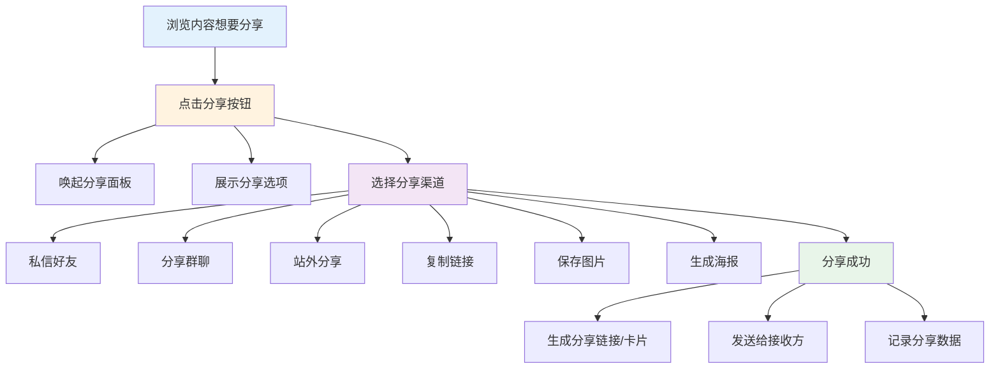

#### 4.3.2 分享互动风险场景识别

| 风险场景 | 风险行为描述 | 识别维度 | 关键识别特征 | 风险等级 |
|---------|------------|---------|------------|---------|
| **分享链接篡改** | 修改分享链接参数，植入恶意代码或重定向 | 内容维度 | 链接参数异常；重定向到非官方页面；包含恶意代码 | 极高 |
| **诱导分享欺诈** | 以虚假奖励诱导用户分享违规或虚假信息 | 内容维度 | 承诺分享返利；奖励无法兑现；分享内容虚假 | 高 |
| **批量分享攻击** | 利用机器批量分享违规内容，扩大传播范围 | 行为维度 | 分享频率异常高；内容违规；设备/账号聚集 | 高 |
| **分享内容侵权** | 分享侵犯他人版权或隐私的内容 | 内容维度 | 未经授权的内容；涉及他人隐私；版权投诉 | 高 |
| **分享数据造假** | 通过技术手段伪造分享数据，制造虚假热度 | 行为维度 | 分享数据与真实传播不符；分享行为模式化 | 中 |
| **钓鱼分享** | 分享伪装成官方活动的钓鱼链接 | 内容维度 | 仿冒官方页面；诱导输入账号密码；链接域名异常 | 极高 |

#### 4.3.3 分享互动风控策略

**风控介入节点：**

| 介入节点 | 风控策略 | 触发条件 | 处置方式 |
|---------|---------|---------|---------|
| 分享内容审核 | 内容安全审核+链接检测 | 分享内容生成时 | 违规内容拦截/链接告警 |
| 分享频率控制 | 分享次数限制+间隔控制 | 分享频率异常 | 限制分享功能/要求验证 |
| 链接安全检测 | URL安全扫描+域名信誉检查 | 分享链接生成时 | 风险链接拦截/替换 |
| 分享数据监控 | 分享数据真实性校验 | 分享数据异常 | 过滤虚假分享数据 |
| 接收方保护 | 链接预览+安全提示 | 接收方点击链接时 | 风险链接警告/拦截 |

**风险识别能力：**

| 识别能力 | 识别方法 | 应用场景 |
|---------|---------|---------|
| 链接安全识别 | URL信誉库+实时扫描+参数分析 | 识别恶意链接、钓鱼网站 |
| 分享行为识别 | 频率分析+行为模式+设备检测 | 识别机器批量分享 |
| 内容安全识别 | 内容审核+版权检测+隐私识别 | 识别违规分享内容 |
| 分享质量评估 | 传播路径分析+用户反馈 | 识别虚假分享数据 |

**风险处置措施：**

| 风险等级 | 处置措施 | 处置时效 |
|---------|---------|---------|
| 极高风险 | 拦截分享+封禁链接+账号处罚 | 实时 |
| 高风险 | 限制分享功能+链接替换+内容审核 | 实时 |
| 中风险 | 标记监控+分享降权+安全提示 | 实时 |

---

### 4.4 关注互动

#### 4.4.1 关注业务流程

```
┌─────────────────────────────────────────────────────────────┐
│                       关注业务流程                           │
├─────────────────────────────────────────────────────────────┤
│                                                             │
│  ┌──────────┐                                               │
│  │ 浏览内容 │                                               │
│  │ 喜欢创作者│                                               │
│  └────┬─────┘                                               │
│       │                                                     │
│       ▼                                                     │
│  ┌──────────────────────────────────────────┐              │
│  │              关注入口                     │              │
│  │  ┌──────────┐ ┌──────────┐ ┌──────────┐ │              │
│  │  │ 头像旁   │ │ 个人主页 │ │ 直播间   │ │              │
│  │  │ 关注按钮 │ │ 关注按钮 │ │ 关注按钮 │ │              │
│  │  └──────────┘ └──────────┘ └──────────┘ │              │
│  └──────────────┬───────────────────────────┘              │
│                 │                                           │
│                 ▼                                           │
│  ┌──────────────────────────────────────────┐              │
│  │              点击关注                     │              │
│  │  - 关注成功提示                           │              │
│  │  - 粉丝数+1                               │              │
│  │  - 更新关注列表                           │              │
│  └──────────────┬───────────────────────────┘              │
│                 │                                           │
│                 ▼                                           │
│  ┌──────────────────────────────────────────┐              │
│  │              后续触达                     │              │
│  │  - 内容更新推送                           │              │
│  │  - 直播开播提醒                           │              │
│  │  - 关注Feed流展示                         │              │
│  └──────────────────────────────────────────┘              │
│                                                             │
└─────────────────────────────────────────────────────────────┘
```

**Mermaid代码实现：**

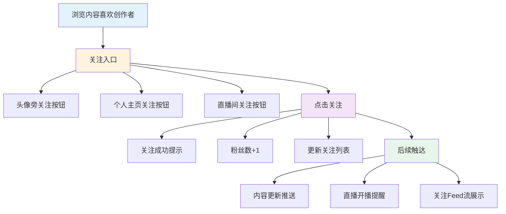

#### 4.4.2 关注互动风险场景识别

| 风险场景 | 风险行为描述 | 识别维度 | 关键识别特征 | 风险等级 |
|---------|------------|---------|------------|---------|
| **机器刷粉** | 使用自动化脚本批量关注账号，制造虚假粉丝数据 | 行为维度 | 关注频率异常高；无浏览行为直接关注；设备/账号聚集 | 高 |
| **虚假粉丝交易** | 买卖粉丝服务，人为提升账号粉丝量 | 关联维度 | 粉丝账号行为异常；粉丝与内容互动率低；付费痕迹 | 高 |
| **恶意关注攻击** | 批量关注后批量取消，干扰账号数据 | 行为维度 | 关注后立即取消；批量操作；针对特定账号 | 中 |
| **诱导关注欺诈** | 以虚假承诺诱导用户关注（如"关注送礼品"） | 内容维度 | 承诺无法兑现；诱导关注话术；用户投诉 | 中 |
| **僵尸粉养号** | 批量注册账号关注特定账号，为后续违规做准备 | 关联维度 | 粉丝账号无活跃行为；注册时间集中；设备/IP聚集 | 高 |
| **关注诈骗** | 以"回关赚钱""关注返利"等名义进行诈骗 | 内容维度 | 私信诱导关注；承诺关注返现；引导添加联系方式 | 极高 |

#### 4.4.3 关注互动风控策略

**风控介入节点：**

| 介入节点 | 风控策略 | 触发条件 | 处置方式 |
|---------|---------|---------|---------|
| 关注请求校验 | 关注频率限制+行为验证 | 关注频率异常 | 限制关注/要求验证 |
| 关注来源审核 | 账号资质校验+行为分析 | 异常账号关注 | 过滤虚假关注数据 |
| 关注质量评估 | 粉丝质量评分+互动率分析 | 新粉丝产生时 | 低质粉丝标记/清理 |
| 诱导内容监控 | 诱导关注内容识别 | 内容包含诱导话术 | 内容降权/删除 |
| 关注数据审计 | 关注数据真实性校验 | 关注数据异常波动 | 过滤虚假关注 |

**风险识别能力：**

| 识别能力 | 识别方法 | 应用场景 |
|---------|---------|---------|
| 关注行为识别 | 频率分析+时序特征+设备检测 | 识别机器刷粉 |
| 粉丝质量评估 | 粉丝活跃度+互动行为分析 | 识别僵尸粉、低质粉丝 |
| 诱导内容识别 | NLP文本识别+模式匹配 | 识别诱导关注话术 |
| 账号关联分析 | 关注账号关系网络分析 | 识别刷粉团伙 |

**风险处置措施：**

| 风险等级 | 处置措施 | 处置时效 |
|---------|---------|---------|
| 极高风险 | 拦截关注+封禁账号+删除诱导内容 | 实时 |
| 高风险 | 限制关注功能+过滤虚假关注数据+账号警告 | 实时 |
| 中风险 | 标记监控+降低关注权重+清理僵尸粉 | 实时 |

---

## 五、商品意向业务流程

### 5.1 点击商品查看详情

#### 5.1.1 商品详情查看流程

```
┌─────────────────────────────────────────────────────────────┐
│                     商品详情查看流程                         │
├─────────────────────────────────────────────────────────────┤
│                                                             │
│  ┌──────────┐                                               │
│  │ 浏览内容 │                                               │
│  │ 看到商品 │                                               │
│  └────┬─────┘                                               │
│       │                                                     │
│       ▼                                                     │
│  ┌──────────────────────────────────────────┐              │
│  │              点击商品入口                 │              │
│  │  ┌──────────┐ ┌──────────┐ ┌──────────┐ │              │
│  │  │ 购物车   │ │ 商品橱窗 │ │ 评论区   │ │              │
│  │  │ 图标     │ │ 商品卡片 │ │ 蓝色链接 │ │              │
│  │  └──────────┘ └──────────┘ └──────────┘ │              │
│  └──────────────┬───────────────────────────┘              │
│                 │                                           │
│                 ▼                                           │
│  ┌──────────────────────────────────────────┐              │
│  │              商品详情页展示               │              │
│  │  ┌──────────┐ ┌──────────┐ ┌──────────┐ │              │
│  │  │ 商品主图 │ │ 价格信息 │ │ 商品规格 │ │              │
│  │  │ 轮播     │ │ 优惠活动 │ │ 选择     │ │              │
│  │  └──────────┘ └──────────┘ └──────────┘ │              │
│  │  ┌──────────┐ ┌──────────┐ ┌──────────┐ │              │
│  │  │ 商品详情 │ │ 用户评价 │ │ 店铺信息 │ │              │
│  │  │ 图文     │ │ 晒单     │ │ 资质     │ │              │
│  │  └──────────┘ └──────────┘ └──────────┘ │              │
│  └──────────────┬───────────────────────────┘              │
│                 │                                           │
│                 ▼                                           │
│  ┌──────────────────────────────────────────┐              │
│  │              用户决策行为                 │              │
│  │  ┌──────────┐ ┌──────────┐ ┌──────────┐ │              │
│  │  │ 浏览详情 │ │ 查看评价 │ │ 咨询客服 │ │              │
│  │  └──────────┘ └──────────┘ └──────────┘ │              │
│  └──────────────────────────────────────────┘              │
│                                                             │
└─────────────────────────────────────────────────────────────┘
```

**Mermaid代码实现：**

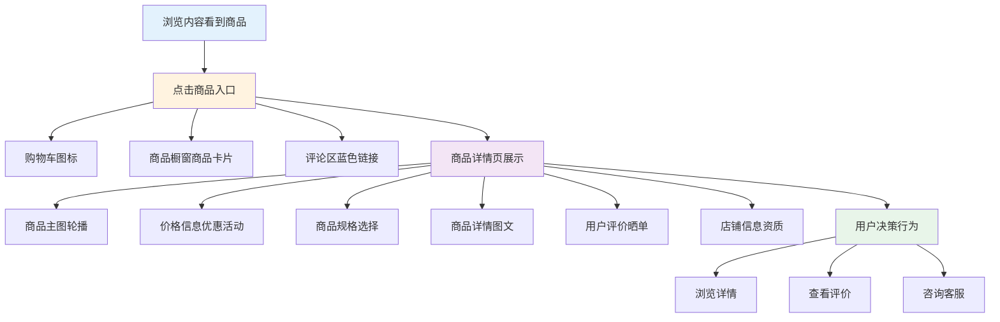

#### 5.1.2 商品详情查看风险场景识别

| 风险场景 | 风险行为描述 | 识别维度 | 关键识别特征 | 风险等级 |
|---------|------------|---------|------------|---------|
| **虚假商品详情** | 商品详情页信息虚假，与实际商品严重不符 | 内容维度 | 图文描述与实物差异大；使用盗图；夸大功效 | 高 |
| **价格欺诈** | 通过虚假原价、虚假折扣误导消费者 | 内容维度 | 原价虚高；折扣计算错误；先涨后降 | 高 |
| **规格信息误导** | 商品规格参数虚假或误导消费者 | 内容维度 | 参数与实际不符；单位混淆；尺寸重量虚标 | 中 |
| **评价数据造假** | 通过刷单制造虚假好评，删除差评 | 行为维度 | 好评内容模板化；评价时间集中；差评被屏蔽 | 高 |
| **恶意爬虫** | 批量抓取商品详情数据用于竞品分析 | 行为维度 | 访问频率异常；无购买行为；IP段聚集 | 中 |
| **站外引流** | 在商品详情页诱导用户添加微信、跳转站外 | 内容维度 | 包含联系方式；引导站外交易；规避平台监管 | 极高 |

#### 5.1.3 商品详情查看风控策略

**风控介入节点：**

| 介入节点 | 风控策略 | 触发条件 | 处置方式 |
|---------|---------|---------|---------|
| 商品详情审核 | 图文内容审核+信息真实性校验 | 商品上架/更新时 | 违规商品拦截/要求整改 |
| 价格监控 | 价格波动监控+比价分析 | 价格异常变动 | 价格审核/异常告警 |
| 评价数据监控 | 评价真实性校验+刷单识别 | 评价数据异常 | 过滤虚假评价/店铺处罚 |
| 访问行为监控 | 反爬虫策略+频率限制 | 访问行为异常 | 限制访问/验证码验证 |
| 站外引流监控 | 联系方式识别+链接检测 | 检测到引流信息 | 内容拦截/店铺处罚 |

**风险识别能力：**

| 识别能力 | 识别方法 | 应用场景 |
|---------|---------|---------|
| 商品信息识别 | 图文审核+OCR+关键词匹配 | 识别虚假/违规商品信息 |
| 价格异常识别 | 价格波动分析+市场比价 | 识别价格欺诈 |
| 评价真实性识别 | 内容分析+行为分析+账号关联 | 识别刷单评价 |
| 爬虫行为识别 | 请求特征分析+行为模式识别 | 识别数据爬取 |

**风险处置措施：**

| 风险等级 | 处置措施 | 处置时效 |
|---------|---------|---------|
| 极高风险 | 商品立即下架+店铺处罚+账号封禁 | 实时 |
| 高风险 | 商品降权/限流+要求整改+加强监控 | 实时 |
| 中风险 | 标记观察+降低搜索排名 | 实时 |

---

### 5.2 商品收藏

#### 5.2.1 商品收藏流程

```
┌─────────────────────────────────────────────────────────────┐
│                       商品收藏流程                           │
├─────────────────────────────────────────────────────────────┤
│                                                             │
│  ┌──────────┐                                               │
│  │ 浏览商品 │                                               │
│  │ 产生兴趣 │                                               │
│  └────┬─────┘                                               │
│       │                                                     │
│       ▼                                                     │
│  ┌──────────────────────────────────────────┐              │
│  │              收藏入口                     │              │
│  │  ┌──────────┐ ┌──────────┐ ┌──────────┐ │              │
│  │  │ 商品详情 │ │ 商品卡片 │ │ 直播间   │ │              │
│  │  │ 页收藏   │ │ 收藏按钮 │ │ 商品列表 │ │              │
│  │  │ 按钮     │ │          │ │ 收藏     │ │              │
│  │  └──────────┘ └──────────┘ └──────────┘ │              │
│  └──────────────┬───────────────────────────┘              │
│                 │                                           │
│                 ▼                                           │
│  ┌──────────────────────────────────────────┐              │
│  │              点击收藏                     │              │
│  │  - 收藏成功提示                           │              │
│  │  - 收藏数+1                               │              │
│  │  - 更新收藏列表                           │              │
│  └──────────────┬───────────────────────────┘              │
│                 │                                           │
│                 ▼                                           │
│  ┌──────────────────────────────────────────┐              │
│  │              收藏管理                     │              │
│  │  - 查看收藏列表                           │              │
│  │  - 收藏商品分类                           │              │
│  │  - 降价提醒设置                           │              │
│  └──────────────────────────────────────────┘              │
│                                                             │
└─────────────────────────────────────────────────────────────┘
```

**Mermaid代码实现：**

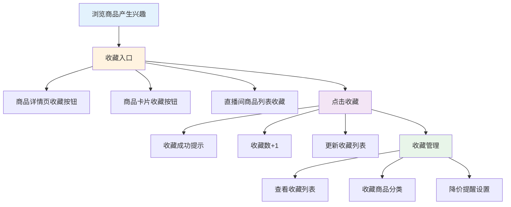

#### 5.2.2 商品收藏风险场景识别

| 风险场景 | 风险行为描述 | 识别维度 | 关键识别特征 | 风险等级 |
|---------|------------|---------|------------|---------|
| **机器刷收藏** | 使用自动化脚本批量收藏商品，制造虚假热度 | 行为维度 | 收藏频率异常高；无浏览行为直接收藏；设备/账号聚集 | 中 |
| **收藏数据造假** | 通过刷收藏数据提升商品在收藏榜排名 | 行为维度 | 收藏数据与真实用户行为不符；收藏后无后续行为 | 中 |
| **恶意收藏攻击** | 批量收藏后批量取消，干扰商品数据 | 行为维度 | 收藏后立即取消；批量操作；针对特定商品 | 低 |
| **收藏作弊** | 以虚假奖励诱导用户收藏商品 | 内容维度 | 承诺收藏返利；奖励无法兑现；诱导收藏话术 | 中 |
| **收藏夹滥用** | 利用收藏夹功能存储违规内容或信息 | 内容维度 | 收藏商品用于非法目的；收藏夹内容异常 | 高 |

#### 5.2.3 商品收藏风控策略

**风控介入节点：**

| 介入节点 | 风控策略 | 触发条件 | 处置方式 |
|---------|---------|---------|---------|
| 收藏请求校验 | 收藏频率限制+行为验证 | 收藏频率异常 | 限制收藏/要求验证 |
| 收藏数据监控 | 收藏数据真实性校验 | 收藏数据异常增长 | 过滤虚假收藏数据 |
| 收藏行为分析 | 收藏后行为跟踪分析 | 收藏行为异常 | 标记异常收藏/降权 |
| 诱导收藏监控 | 诱导收藏内容识别 | 检测到诱导话术 | 内容降权/删除 |

**风险识别能力：**

| 识别能力 | 识别方法 | 应用场景 |
|---------|---------|---------|
| 收藏行为识别 | 频率分析+时序特征+设备检测 | 识别机器刷收藏 |
| 收藏质量评估 | 收藏者行为质量分析 | 识别低质量收藏 |
| 诱导内容识别 | NLP文本识别+模式匹配 | 识别诱导收藏话术 |
| 账号关联分析 | 收藏账号关系网络分析 | 识别刷收藏团伙 |

**风险处置措施：**

| 风险等级 | 处置措施 | 处置时效 |
|---------|---------|---------|
| 高风险 | 限制收藏功能+过滤虚假收藏数据 | 实时 |
| 中风险 | 标记监控+降低收藏权重 | 实时 |
| 低风险 | 记录日志+日常监控 | 实时 |

---

### 5.3 加入购物车

#### 5.3.1 加入购物车流程

```
┌─────────────────────────────────────────────────────────────┐
│                      加入购物车流程                          │
├─────────────────────────────────────────────────────────────┤
│                                                             │
│  ┌──────────┐                                               │
│  │ 浏览商品 │                                               │
│  │ 决定购买 │                                               │
│  └────┬─────┘                                               │
│       │                                                     │
│       ▼                                                     │
│  ┌──────────────────────────────────────────┐              │
│  │              点击加购                     │              │
│  │  - 商品详情页"加入购物车"按钮             │              │
│  │  - 商品卡片"加购"按钮                     │              │
│  └──────────────┬───────────────────────────┘              │
│                 │                                           │
│                 ▼                                           │
│  ┌──────────────────────────────────────────┐              │
│  │              规格选择（如需要）           │              │
│  │  - 选择颜色/尺码/规格                     │              │
│  │  - 选择数量                               │              │
│  │  - 确认选择                               │              │
│  └──────────────┬───────────────────────────┘              │
│                 │                                           │
│                 ▼                                           │
│  ┌──────────────────────────────────────────┐              │
│  │              加购成功                     │              │
│  │  - 购物车数量更新                         │              │
│  │  - 成功提示动画                           │              │
│  │  - 继续浏览/去购物车                      │              │
│  └──────────────────────────────────────────┘              │
│                                                             │
└─────────────────────────────────────────────────────────────┘
```

**Mermaid代码实现：**

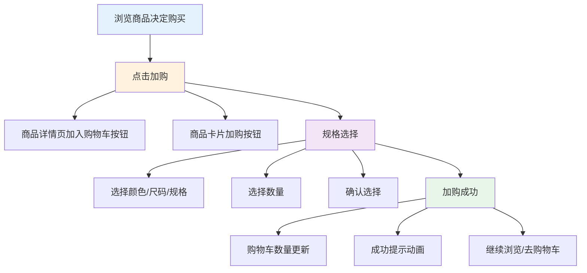

#### 5.3.2 加入购物车风险场景识别

| 风险场景 | 风险行为描述 | 识别维度 | 关键识别特征 | 风险等级 |
|---------|------------|---------|------------|---------|
| **机器刷加购** | 使用自动化脚本批量加购，制造虚假购买意向 | 行为维度 | 加购频率异常高；无浏览行为直接加购；设备/账号聚集 | 中 |
| **加购数据造假** | 通过刷加购数据提升商品在加购榜排名 | 行为维度 | 加购数据与真实用户行为不符；加购后无后续行为 | 中 |
| **恶意库存占用** | 批量加购限量商品占用库存，阻碍正常用户购买 | 行为维度 | 短时间内大量加购限量商品；加购后不结算；多账号协同 | 高 |
| **加购作弊** | 以虚假奖励诱导用户加购商品 | 内容维度 | 承诺加购返利；奖励无法兑现；诱导加购话术 | 中 |
| **异常数量加购** | 加购数量异常，超出正常购买需求 | 行为维度 | 单次加购数量过大；加购数量与商品属性不符 | 中 |
| **黄牛囤货预备** | 批量加购热门商品，为后续高价转售做准备 | 行为维度 | 加购商品集中在热门/限量款；加购时间集中；多账号操作 | 高 |

#### 5.3.3 加入购物车风控策略

**风控介入节点：**

| 介入节点 | 风控策略 | 触发条件 | 处置方式 |
|---------|---------|---------|---------|
| 加购请求校验 | 加购频率限制+数量限制 | 加购频率/数量异常 | 限制加购/要求验证 |
| 库存保护机制 | 单账号限购+库存锁定策略 | 限量商品加购 | 限制加购数量/排队机制 |
| 加购数据监控 | 加购数据真实性校验 | 加购数据异常增长 | 过滤虚假加购数据 |
| 加购行为分析 | 加购后行为跟踪分析 | 加购行为异常 | 标记异常加购/降权 |
| 诱导加购监控 | 诱导加购内容识别 | 检测到诱导话术 | 内容降权/删除 |

**风险识别能力：**

| 识别能力 | 识别方法 | 应用场景 |
|---------|---------|---------|
| 加购行为识别 | 频率分析+时序特征+设备检测 | 识别机器刷加购 |
| 库存异常识别 | 加购数量分析+账号关联分析 | 识别恶意库存占用 |
| 黄牛行为识别 | 商品集中度分析+行为模式识别 | 识别囤货预备行为 |
| 诱导内容识别 | NLP文本识别+模式匹配 | 识别诱导加购话术 |

**风险处置措施：**

| 风险等级 | 处置措施 | 处置时效 |
|---------|---------|---------|
| 高风险 | 限制加购数量+库存保护+账号验证 | 实时 |
| 中风险 | 标记监控+降低加购权重+限制功能 | 实时 |
| 低风险 | 记录日志+日常监控 | 实时 |

---

## 六、浏览种草阶段风险防控策略

### 6.1 风险行为识别

#### 6.1.1 流量作弊风险

| 风险类型 | 风险行为描述 | 风险等级 | 业务影响 |
|---------|------------|---------|---------|
| 机器刷量 | 使用自动化脚本模拟真实用户浏览、点赞、评论 | 极高 | 扭曲内容推荐算法，浪费平台流量资源 |
| 刷量工作室 | 组织真人进行批量刷赞、刷评论、刷分享 | 高 | 虚假热度，误导其他用户决策 |
| 协议破解 | 通过逆向工程破解推荐接口，批量获取流量 | 高 | 破坏推荐公平性，影响正常创作者 |
| 虚假点击 | 利用模拟器、虚拟机产生虚假点击数据 | 高 | 广告主利益受损，平台收入下降 |

#### 6.1.2 内容违规风险

| 风险类型 | 风险行为描述 | 风险等级 | 业务影响 |
|---------|------------|---------|---------|
| 虚假宣传 | 夸大商品功效，发布虚假广告内容 | 极高 | 用户权益受损，平台信誉下降 |
| 违禁品推广 | 推广法律法规禁止销售的商品 | 极高 | 法律合规风险，平台处罚 |
| 侵权内容 | 盗用他人视频、图片、音乐等 | 高 | 知识产权纠纷，创作者流失 |
| 低俗内容 | 发布色情、暴力、恶心等低俗内容 | 高 | 用户体验受损，品牌形象下降 |

#### 6.1.3 恶意营销风险

| 风险类型 | 风险行为描述 | 风险等级 | 业务影响 |
|---------|------------|---------|---------|
| 垃圾广告 | 在评论区大量发布广告信息 | 中 | 污染社区环境，用户体验下降 |
| 引流站外 | 诱导用户添加微信、QQ等站外联系方式 | 中 | 交易脱离平台，平台收入损失 |
| 虚假种草 | 发布虚假使用体验，误导消费者购买 | 高 | 用户信任度下降，退货率上升 |
| 恶意差评 | 竞争对手恶意发布负面评价 | 中 | 商家利益受损，平台生态恶化 |

#### 6.1.4 账号异常风险

| 风险类型 | 风险行为描述 | 风险等级 | 业务影响 |
|---------|------------|---------|---------|
| 批量注册 | 批量注册账号用于刷量、薅羊毛 | 高 | 账号体系污染，风控成本增加 |
| 账号买卖 | 买卖高粉账号、实名账号 | 中 | 账号安全风险，黑产渗透 |
| 养号行为 | 长期低质量活跃，为后续违规做准备 | 中 | 隐蔽性强，难以提前识别 |
| 被盗账号 | 账号被盗用于发布违规内容 | 中 | 用户权益受损，投诉增加 |

---

### 6.2 风控介入策略

#### 6.2.1 流量分发环节

| 介入节点 | 风控策略 | 触发条件 | 处置方式 |
|---------|---------|---------|---------|
| 内容准入审核 | 机器预审+人工复审 | 新发布内容 | 违规内容拦截，账号警告 |
| 推荐排序干预 | 降权/限流处理 | 疑似刷量内容 | 减少推荐曝光，观察期处理 |
| 流量质量校验 | 实时流量清洗 | 异常流量特征 | 过滤虚假流量，保护广告主 |
| 热门榜单审核 | 上榜内容复核 | 进入热门榜单 | 确保榜单内容质量合规 |

#### 6.2.2 内容互动环节

| 介入节点 | 风控策略 | 触发条件 | 处置方式 |
|---------|---------|---------|---------|
| 评论发布审核 | 先审后发/先发后审 | 评论内容风险分 | 拦截违规评论，限制评论权限 |
| 点赞行为校验 | 点赞频率限制 | 单位时间点赞数异常 | 限制点赞功能，行为验证 |
| 分享行为监控 | 分享内容审核 | 分享内容风险等级 | 拦截违规分享，限制分享次数 |
| 关注行为限制 | 关注频率控制 | 短时间内大量关注 | 限制关注功能，账号观察 |

#### 6.2.3 商品展示环节

| 介入节点 | 风控策略 | 触发条件 | 处置方式 |
|---------|---------|---------|---------|
| 商品准入审核 | 商品信息审核 | 新上架商品 | 违规商品下架，店铺处罚 |
| 商品描述审核 | 虚假宣传识别 | 商品描述风险分 | 要求整改，限制推广 |
| 价格监控 | 异常价格预警 | 价格异常波动 | 价格审核，防止欺诈 |
| 店铺资质审核 | 资质真实性校验 | 店铺入驻/经营 | 资质不符下架，清退处理 |

---

### 6.3 风险识别能力

#### 6.3.1 设备维度识别

| 识别能力 | 识别方法 | 应用场景 |
|---------|---------|---------|
| 设备指纹识别 | 采集设备硬件、软件特征生成唯一标识 | 识别同一设备多账号操作 |
| 模拟器检测 | 检测运行环境特征（CPU、内存、传感器） | 识别模拟器、虚拟机刷量 |
| 设备风险评分 | 基于设备历史行为建立风险画像 | 设备级风险拦截 |
| 群控设备识别 | 识别批量设备的共性特征 | 打击群控工作室 |

#### 6.3.2 行为维度识别

| 识别能力 | 识别方法 | 应用场景 |
|---------|---------|---------|
| 行为序列分析 | 分析用户操作轨迹的合理性 | 识别机器自动化操作 |
| 频率异常检测 | 检测单位时间内操作频次 | 识别刷量、刷赞行为 |
| 行为模式聚类 | 聚类相似行为模式 | 发现批量操作群体 |
| 时序特征分析 | 分析行为时间分布规律 | 识别非人类作息模式 |

#### 6.3.3 内容维度识别

| 识别能力 | 识别方法 | 应用场景 |
|---------|---------|---------|
| 文本内容审核 | NLP技术识别违规文本 | 评论、标题、描述审核 |
| 图像内容审核 | CV技术识别违规图片 | 商品图、视频封面审核 |
| 视频内容审核 | 视频理解技术识别违规 | 短视频、直播内容审核 |
| 音频内容审核 | 语音识别+语义分析 | 直播语音、视频音频审核 |

#### 6.3.4 关联维度识别

| 识别能力 | 识别方法 | 应用场景 |
|---------|---------|---------|
| 账号关联分析 | 分析账号间的关联关系 | 发现团伙作案 |
| 设备关联分析 | 分析设备与账号的关联 | 识别设备共用、设备农场 |
| IP关联分析 | 分析IP与行为的关联 | 识别代理IP、IDC流量 |
| 内容相似度分析 | 计算内容相似度 | 识别搬运、抄袭内容 |

---

### 6.4 风险处置策略

#### 6.4.1 风险分级体系

| 风险等级 | 分值区间 | 处置策略 | 处置时效 |
|---------|---------|---------|---------|
| 极高风险 | 90-100 | 立即拦截+账号封禁 | 实时 |
| 高风险 | 70-89 | 限制功能+人工审核 | <5分钟 |
| 中风险 | 50-69 | 降权处理+观察监控 | <30分钟 |
| 低风险 | <50 | 标记观察+行为记录 | 日常监控 |

#### 6.4.2 分级处置措施

**内容层面处置：**

| 处置措施 | 适用场景 | 执行方式 | 恢复条件 |
|---------|---------|---------|---------|
| 内容下架 | 违规内容 | 立即下架，停止传播 | 整改后重新审核 |
| 内容限流 | 疑似违规 | 减少推荐曝光 | 观察期后自动恢复 |
| 内容降权 | 低质内容 | 降低搜索排名 | 质量提升后恢复 |
| 禁止推广 | 违规推广 | 禁止付费推广 | 整改后申请恢复 |

**账号层面处置：**

| 处置措施 | 适用场景 | 执行方式 | 恢复条件 |
|---------|---------|---------|---------|
| 功能限制 | 轻度违规 | 限制发布/评论/直播 | 观察期后自动恢复 |
| 流量降权 | 刷量行为 | 减少内容推荐 | 停止违规行为后恢复 |
| 账号封禁 | 严重违规 | 永久封禁账号 | 不可恢复 |
| 设备封禁 | 设备级违规 | 封禁设备注册/登录 | 不可恢复 |

**店铺层面处置：**

| 处置措施 | 适用场景 | 执行方式 | 恢复条件 |
|---------|---------|---------|---------|
| 商品下架 | 违规商品 | 下架违规商品 | 整改后重新上架 |
| 店铺限流 | 违规经营 | 减少店铺曝光 | 整改后恢复 |
| 保证金扣除 | 违规处罚 | 扣除相应保证金 | 不可恢复 |
| 店铺清退 | 严重违规 | 清退店铺，永不合作 | 不可恢复 |

---

### 6.5 误判处理机制

#### 6.5.1 申诉渠道设计

| 申诉渠道 | 适用场景 | 入口位置 | 处理时效 |
|---------|---------|---------|---------|
| 在线申诉 | 内容/账号处罚 | 处罚通知页面 | 24小时内响应 |
| 客服申诉 | 复杂问题 | 客服中心 | 4小时内响应 |
| 创作者服务中心 | 创作者专属 | 创作者后台 | 2小时内响应 |
| 商家后台申诉 | 商家处罚 | 商家后台 | 2小时内响应 |

#### 6.5.2 审核机制

**三级审核体系：**

```
┌─────────────────────────────────────────────────────────────┐
│                      三级审核体系                            │
├─────────────────────────────────────────────────────────────┤
│                                                             │
│  第一级：机器审核                                           │
│  ┌──────────────────────────────────────────┐              │
│  │  - 自动识别误判场景                       │              │
│  │  - 低风险自动放行                         │              │
│  │  - 明确违规直接驳回                       │              │
│  └──────────────────┬───────────────────────┘              │
│                     │                                       │
│                     ▼ 无法判定                              │
│  第二级：人工审核                                           │
│  ┌──────────────────────────────────────────┐              │
│  │  - 专业审核团队复核                       │              │
│  │  - 结合上下文综合判断                     │              │
│  │  - 标准案例库比对                         │              │
│  └──────────────────┬───────────────────────┘              │
│                     │                                       │
│                     ▼ 争议较大                              │
│  第三级：专家仲裁                                           │
│  ┌──────────────────────────────────────────┐              │
│  │  - 资深审核专家裁决                       │              │
│  │  - 多轮讨论确定结论                       │              │
│  │  - 终审结果不可申诉                       │              │
│  └──────────────────────────────────────────┘              │
│                                                             │
└─────────────────────────────────────────────────────────────┘
```

**Mermaid代码实现：**

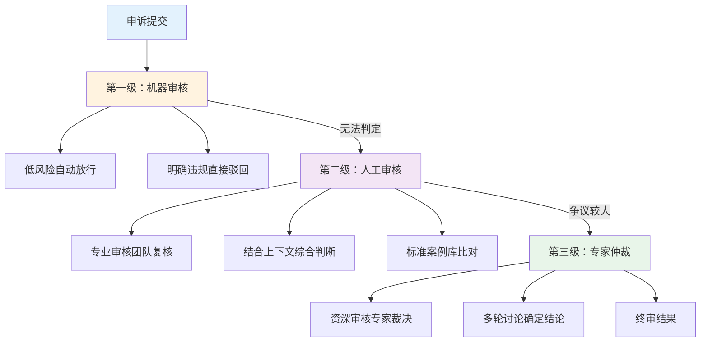

#### 6.5.3 用户权益恢复

| 恢复类型 | 适用场景 | 恢复方式 | 时效要求 |
|---------|---------|---------|---------|
| 内容恢复 | 误判下架 | 审核通过后恢复展示 | 24小时内 |
| 功能恢复 | 误判限制 | 自动解除限制 | 即时 |
| 流量补偿 | 误判限流 | 增加推荐权重补偿 | 7天内 |
| 信用修复 | 误判处罚 | 清除违规记录 | 审核通过后 |

#### 6.5.4 误判预防优化

| 优化措施 | 具体方案 | 预期效果 |
|---------|---------|---------|
| 规则优化 | 定期更新审核规则，减少模糊地带 | 降低误判率 |
| 模型迭代 | 基于误判案例优化识别模型 | 提升识别准确率 |
| 案例库建设 | 建立标准案例库，统一审核标准 | 提升审核一致性 |
| 用户教育 | 明确社区规范，提前告知风险 | 减少无意违规 |

---

## 七、相关文档链接

| 文档名称 | 文档路径 | 说明 |
|---------|---------|------|
| 抖音电商风控体系建设规划文档 | `../抖音电商风控体系建设规划文档.md` | 总体规划文档 |
| 注册登录业务流程说明文档 | `../注册登录阶段/注册登录业务流程说明文档.md` | 上一场景文档 |

---

## 附录：风险场景清单

| 风险场景 | 风险等级 | 主要风险行为 | 关键识别特征 | 处置策略 |
|---------|---------|------------|------------|---------|
| 机器刷量 | 极高 | 自动化脚本刷播放/点赞/评论 | 行为频率异常、设备指纹异常 | 实时拦截+设备封禁 |
| 刷量工作室 | 高 | 真人批量刷量 | IP聚集、行为模式相似 | 团伙识别+批量处罚 |
| 虚假宣传 | 极高 | 夸大商品功效 | 文本关键词、图像识别 | 内容下架+店铺处罚 |
| 违禁品推广 | 极高 | 推广违禁商品 | 商品类目、关键词匹配 | 立即下架+账号封禁 |
| 侵权内容 | 高 | 盗用他人作品 | 内容相似度比对 | 下架内容+版权处理 |
| 低俗内容 | 高 | 发布色情暴力内容 | CV+ NLP审核 | 内容下架+账号处罚 |
| 垃圾广告 | 中 | 评论区发广告 | 文本模式识别 | 评论拦截+功能限制 |
| 引流站外 | 中 | 诱导添加微信 | 关键词+联系方式识别 | 内容拦截+账号警告 |
| 虚假种草 | 高 | 发布虚假体验 | 账号行为异常+内容分析 | 内容降权+账号观察 |
| 恶意差评 | 中 | 竞争对手恶意差评 | 账号关联+评价内容分析 | 评价删除+账号限制 |
| 批量注册 | 高 | 批量注册账号 | 设备/IP/行为特征聚集 | 注册拦截+账号封禁 |
| 账号买卖 | 中 | 买卖高粉账号 | 账号行为突变 | 账号观察+功能限制 |

---

**文档结束**
